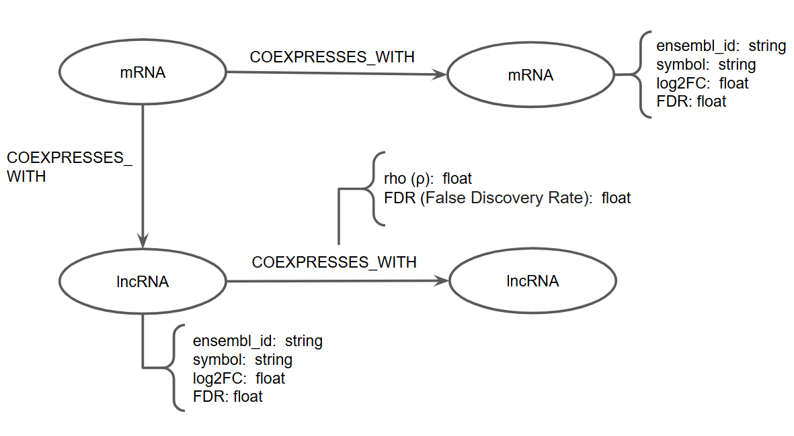

# Projeto Integração de lncRNAs em Redes de Coexpressão para o Estudo de Vias Reguladas no Câncer de Mama Triplo-Negativo (TNBC)

# Project Integration of lncRNAs into Co-expression Networks to Study Regulatory Pathways in Triple-Negative Breast Cancer (TNBC)

# Descrição Resumida do Projeto

Este projeto investiga o papel de RNAs longos não codificantes (lncRNAs) no câncer de mama triplo-negativo (TNBC) a partir de dados de RNA-seq (GSE261989). O objetivo é integrar lncRNAs em análises de expressão diferencial, redes de coexpressão baseadas em WGCNA e enriquecimento de vias biológicas, a fim de identificar hubs regulatórios e módulos gênicos associados a tratamentos experimentais (ativação do receptor de glicocorticoides por DEX, silenciamento de GATA6 por siRNA e inibição do complexo SWI/SNF por BRM014).

# Slides

[Slides para a entrega 1](https://docs.google.com/presentation/d/1DK-9vRPFY9caxmsc-w6zaFOdjhIhT--vUSJ0ziBtS54/edit?usp=sharing)

[Ver documento do Projeto 1](assets/documents/projeto1.pdf)

# Fundamentação Teórica

O câncer de mama triplo-negativo (TNBC) é um subtipo particularmente agressivo de câncer de mama, caracterizado pela ausência de expressão de receptores de estrogênio (ER-negativo), progesterona (PR-negativo) e pela não superexpressão do receptor 2 do fator de crescimento epidérmico humano (HER2/neu). Essa falta de alvos moleculares específicos limita as opções terapêuticas, tornando a quimioterapia o principal recurso de tratamento. No entanto, o TNBC está associado a altas taxas de recidiva e a um prognóstico desfavorável (Lehman et al., 2024; Irvin e Carey, 2014). Esse subtipo acomete com maior frequência mulheres jovens e portadoras de mutações no gene BRCA1, sendo, na maioria dos casos, classificado no subtipo molecular basal-like. Apesar da elevada taxa de resposta inicial à quimioterapia, os pacientes apresentam risco aumentado de recorrência precoce e metástase, contribuindo para a baixa sobrevida global (Schlam et al., 2024; Wu et al., 2015; Foulkes et al., 2010; Diallo-Danebrock et al., 2007).

Avanços recentes na biologia molecular e na epigenética revelam que a regulação gênica aberrante no TNBC envolve os long non-coding RNAs (lncRNAs), RNAs com mais de 200 nucleotídeos que não codificam proteínas, mas modulam a expressão gênica e a progressão tumoral (Palma et al., 2025; Singh et al., 2023; Alberts, 2017). Um dos mecanismos-chave é a interação desses lncRNAs com os complexos SWI/SNF (switching defective/sucrose nonfermenting), remodeladores de cromatina dependentes de ATP, que organizam a estrutura da cromatina e regulam o acesso de fatores de transcrição aos seus genes-alvo (Sheng et al., 2025; Hao et al., 2025; Tang et al., 2017; Masliah-Planchon, 2015). Os lncRNAs podem modular a atividade dos complexos SWI/SNF de diferentes maneiras, funcionando como guias para direcionar os complexos a regiões específicas do genoma, como plataformas estruturais para a montagem do complexo, ou modulando diretamente sua função, impactando genes oncogênicos e supressores tumorais (Oo, et al., 2024; Hao, et al., 2025).

No TNBC, fatores de transcrição como o receptor de glicocorticoides (GR), GATA6, MYC e AP-1 (Wolf et al., 2023; Jones et al., 2022) regulam diferentes programas gênicos que controlam a proliferação celular, a invasão tumoral e a resistência à quimioterapia. O complexo SWI/SNF desempenha um papel central nesse processo, ao remodelar a cromatina e permitir que esses fatores de transcrição alcancem as regiões regulatórias necessárias para ativar seus genes-alvo. Estudos recentes mostram que a inibição da atividade do SWI/SNF interrompe simultaneamente vários desses programas oncogênicos, o que reduz o crescimento do tumor e aumenta a sensibilidade das células cancerígenas ao tratamento (Hao et al., 2025; Singh et al., 2023).

O dataset GSE261989 (Jansen et al., 2025) investigou os mecanismos moleculares do TNBC, usando a linha celular BT549, submetida a três tipos de intervenções: ativação do receptor de glicocorticoides (GR) com dexametasona (DEX), silenciamento do fator de transcrição GATA6 por siRNA e inibição da remodelação de cromatina mediada pelo complexo SWI/SNF por meio do inibidor BRM014. Essas manipulações têm como objetivo compreender como diferentes fatores regulatórios controlam redes de expressão gênica associadas à progressão tumoral. Os autores aplicaram o RNA-seq (sequenciamento de RNA de alto rendimento), permitindo o mapeamento global da expressão de genes codificantes e não codificantes (lncRNAs) em cada condição experimental. A partir desses dados, é possível identificar padrões de co-expressão gênica, genes reguladores centrais (hubs) e vias biológicas ativadas ou silenciadas, fornecendo subsídios para explorar vulnerabilidades do TNBC e potenciais alvos terapêuticos, como a dependência do tumor em relação ao complexo SWI/SNF.

Nesse contexto, destaca-se a utilização do pacote WGCNA (Weighted Gene Co-expression Network Analysis), amplamente empregado para a identificação de módulos de genes altamente correlacionados em dados de expressão gênica e sua associação com características fenotípicas externas (Langfelder e Horvath, 2008; Zhang e Horvath, 2005). O WGCNA parte da construção de redes de coexpressão ponderadas, seguidas pela detecção de módulos por meio de clusterização hierárquica dinâmica, permitindo calcular medidas de conectividade, identificar genes hubs e relacionar módulos a variáveis experimentais de interesse (Barabási e Oltvai, 2004). No presente estudo, essa abordagem será aplicada ao dataset GSE261989, com o objetivo de identificar módulos enriquecidos em lncRNAs e caracterizar potenciais hubs regulatórios. A estrutura resultante será representada em forma de grafo, no qual os nós correspondem a lncRNAs diferencialmente expressos e mRNAs, enquanto as arestas representam relações de coexpressão significativa e associações derivadas do WGCNA. Cada elemento do grafo será anotado com atributos quantitativos obtidos nas análises, como log2FC e FDR (expressão diferencial), kME (centralidade em módulos) e NES/FDR (enriquecimento funcional). Essa representação integrativa permite não apenas mapear redes regulatórias complexas, mas também gerar hipóteses testáveis sobre o papel dos lncRNAs na progressão tumoral do TNBC (Sheng et al., 2025; Hao et al., 2025; Tang et al., 2017; Masliah-Planchon, 2015).

# Perguntas de Pesquisa

O projeto busca responder às seguintes questões:

1. Existem lncRNAs sendo coexpressos com o receptor de glicocorticoide (GR), GATA6, a oncoproteína chave MYC e os fatores de transcrição AP-1?  
2. Os lncRNAs estão presentes em módulos de coexpressão associados aos tratamentos (DEX, siRNA GATA6, BRM014)?  
3. Há lncRNAs identificados como hubs regulatórios nos módulos detectados pelo WGCNA?  
4. Vias biológicas relevantes e enriquecidas estão sendo afetadas pela presença de lncRNAs nos módulos?  
5. Algum lncRNA está diferencialmente expresso de forma significativa entre os tratamentos?  
6. Existem lncRNAs coexpressos entre si, sugerindo potenciais interações regulatórias ou funcionais?  

# Bases de Dados

Base de Dados | Endereço na Web | Resumo descritivo
----- | ----- | -----
GEO – GSE261989 | https://www.ncbi.nlm.nih.gov/geo/query/acc.cgi?acc=GSE261989 | Dataset de RNA-seq da linhagem BT549 de câncer de mama triplo-negativo (TNBC), submetida a três condições experimentais: ativação do GR por dexametasona (DEX), silenciamento de GATA6 por siRNA e inibição do complexo SWI/SNF por BRM014.
GENCODE – Human Release 46 | https://www.gencodegenes.org/human/release_46.html | Base de anotação genômica humana (GRCh38, versão 46), incluindo genes codificantes e não codificantes (lncRNAs), usada para integrar a expressão diferencial com elementos regulatórios.

# Modelo Lógico

# Metodologia
Nosso estudo irá utilizar duas classes de tratamentos: perturbação genética por siRNA e tratamento químico.  

  
*Tabela 1 - Condição e Tratamento por Categoria. Fonte: Elaborado pelo autor.*  

A análise será estruturada em quatro etapas principais:  

1. **Integração de anotações**: incorporação de lncRNAs na anotação do genoma humano GRCh38 (GENCODE Release 46) utilizando **AGAT**.  
2. **Pré-processamento**: controle de qualidade, alinhamento e quantificação com o pipeline **nf-core/rnaseq (v3.13.0)**.  
3. **Expressão diferencial**: identificação de genes diferencialmente expressos entre controle e tratamento com **nf-core/differentialabundance (v1.2.0)**.  
4. **Coexpressão e redes**: construção de redes de coexpressão com **WGCNA (v1.72-1, R)**.  
5. **Enriquecimento funcional**: interpretação com **IPA (QIAGEN)** como ferramenta principal.  

  
*Figura 1 - Visão Geral da metodologia. Fonte: Elaborado pelo autor.*  

# Ferramentas

- **SRA Toolkit (v3.2.1)** – download de dados do NCBI GEO.  
- **nf-core/rnaseq (v3.13.0)** – pré-processamento de RNA-seq.  
- **AGAT (v1.0.0)** – integração de arquivos de anotação GTF/GFF.  
- **nf-core/differentialabundance (v1.2.0)** – análise de expressão diferencial.  
- **WGCNA (v1.72-1, R)** – redes de coexpressão ponderadas.  
- **Ingenuity Pathway Analysis (IPA, QIAGEN)** – enriquecimento funcional (principal).  
- **clusterProfiler (v4.8.3, R)** – alternativa open source para enriquecimento funcional.  
- **Cytoscape (v3.10.2)** – visualização de redes.  

# Referências Bibliográficas

- Palma, A., et al. (2025). Genome biology of long non-coding RNAs in humans: A virtual karyotype. *PLoS Computational Biology*. Disponível em: https://pmc.ncbi.nlm.nih.gov/articles/PMC11847481/  
- Langfelder, P., & Horvath, S. (2008). WGCNA: an R package for weighted correlation network analysis. *BMC Bioinformatics*, 9(1), 559. https://doi.org/10.1186/1471-2105-9-559  
- Ewels, P. A., et al. (2020). The nf-core framework for community-curated bioinformatics pipelines. *Nature Biotechnology*, 38(3), 276–278. https://doi.org/10.1038/s41587-020-0439-x  
- Barabási, A. L., & Oltvai, Z. N. (2004). Network biology: understanding the cell's functional organization. *Nat Rev Genet*, 5(2), 101–113.  
- Masliah-Planchon, J., et al. (2015). SWI/SNF chromatin remodeling and human malignancies. *Annu Rev Pathol*, 10, 145–171.  
- Tang, Y., et al. (2017). [Referência sobre SWI/SNF e regulação tumoral].  
- Sheng, Y., et al. (2025). [Referência sobre lncRNA e remodelação de cromatina].  
- Hao, X., et al. (2025). [Referência sobre SWI/SNF e TNBC].  
- Zhang, B., & Horvath, S. (2005). A general framework for weighted gene co-expression network analysis. *Stat Appl Genet Mol Biol*, 4(1).  
- QIAGEN. Ingenuity Pathway Analysis (IPA). Disponível em: https://digitalinsights.qiagen.com/products-overview/discovery-insights-portfolio/analysis-and-visualization/qiagen-ipa/  
