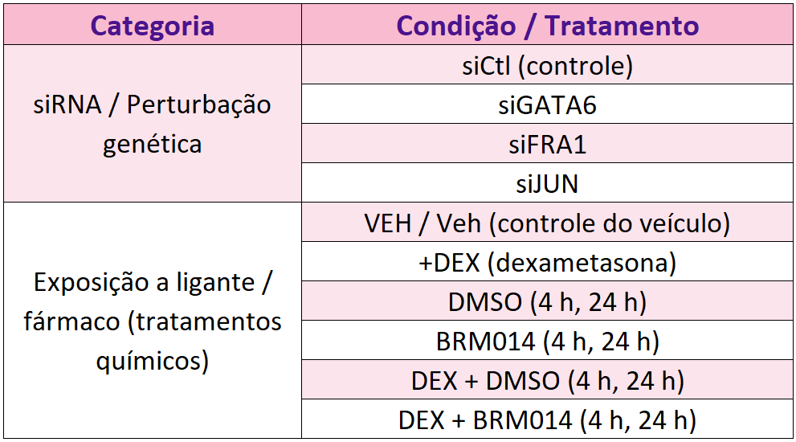
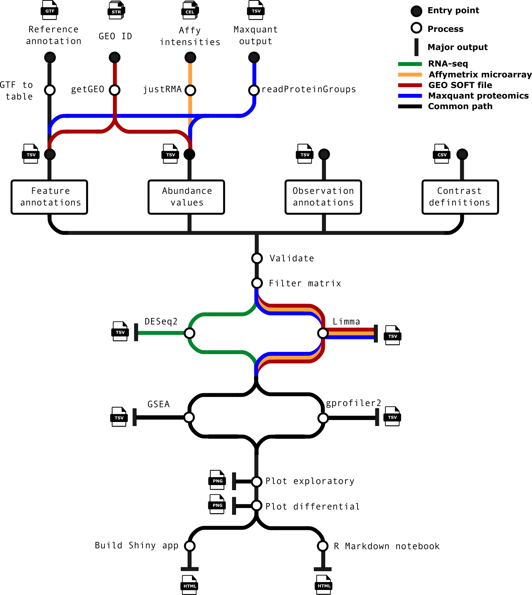
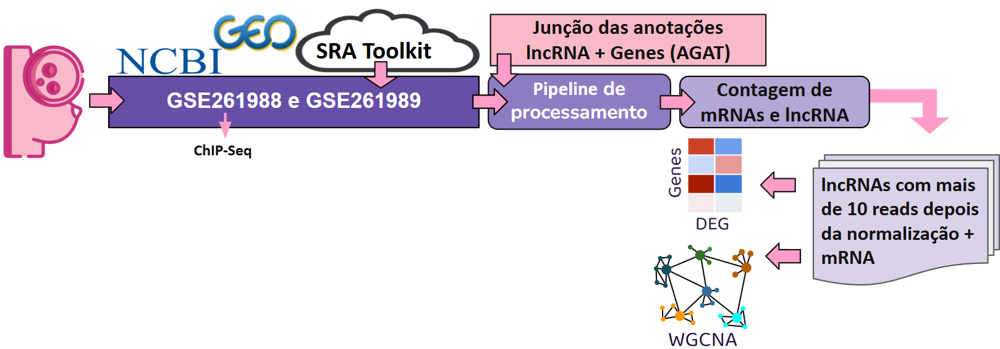
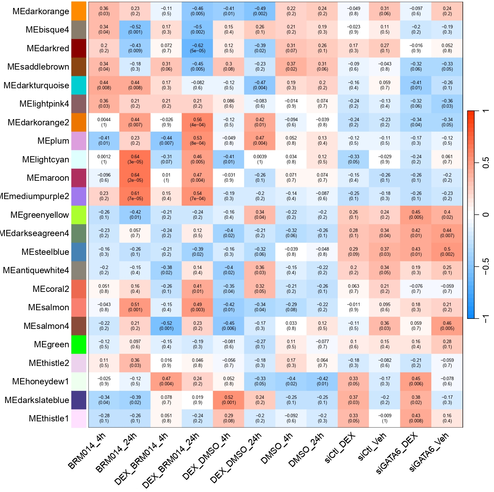
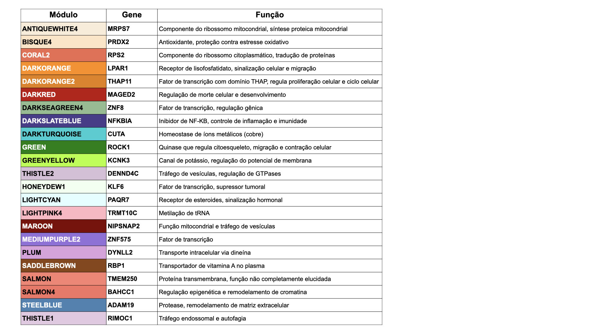
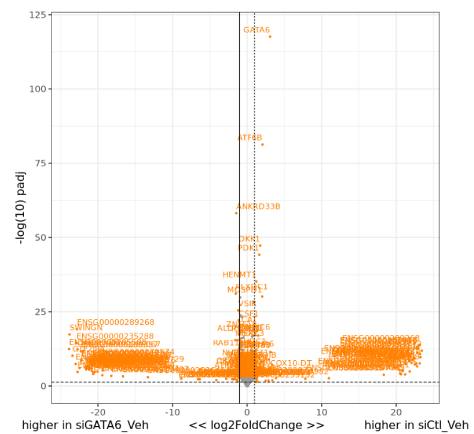
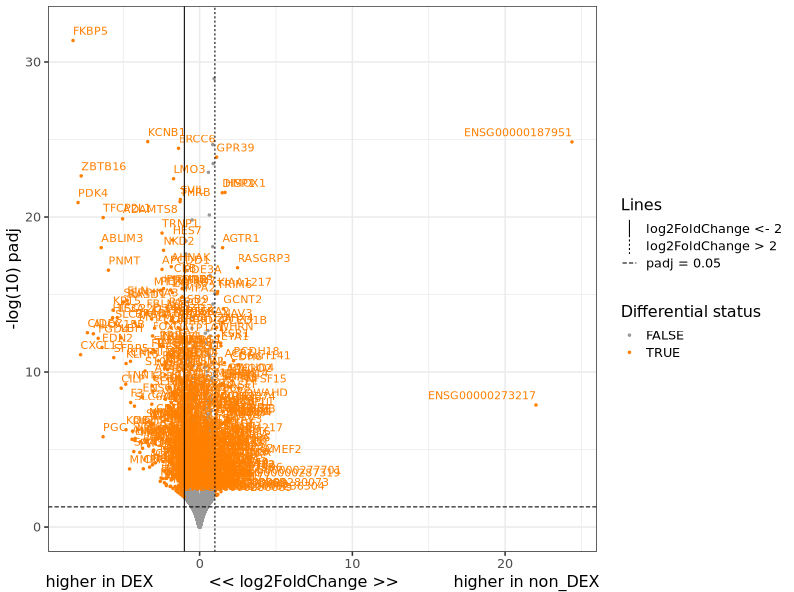
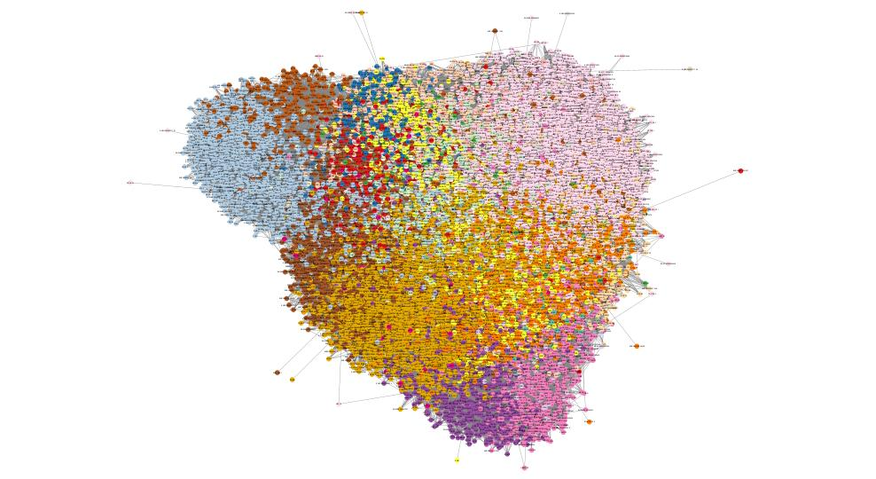
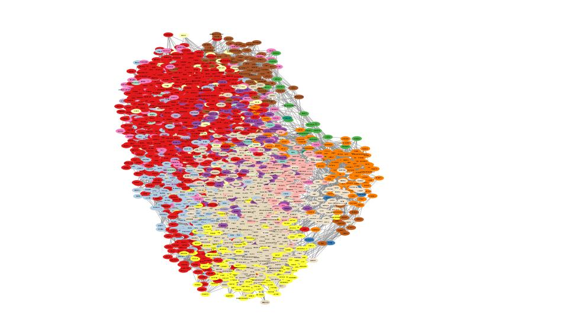
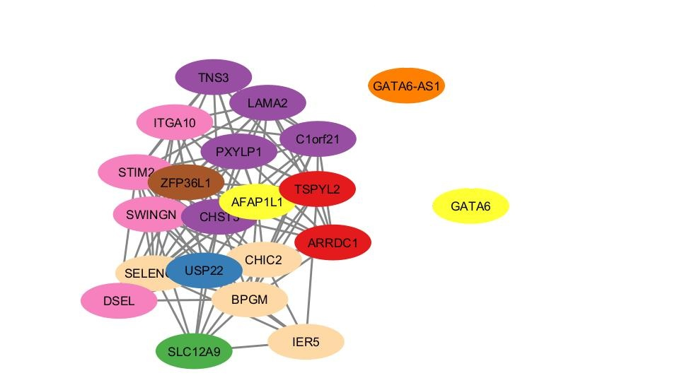

# Projeto Integração de lncRNAs em Redes de Coexpressão para o Estudo de Vias Reguladas no Câncer de Mama Triplo-Negativo (TNBC)
# Project Integration of lncRNAs into Co-expression Networks to Study Regulatory Pathways in Triple-Negative Breast Cancer (TNBC)

# Descrição Resumida do Projeto

O câncer de mama triplo-negativo (TNBC) é um dos subtipos mais agressivos de câncer de mama, caracterizado pela ausência de receptores de estrogênio (ER), progesterona (PR) e HER2/neu, o que limita as opções terapêuticas e resulta em altas taxas de recidiva e metástase precoce. Este projeto investiga o papel de RNAs longos não codificantes (lncRNAs) na regulação epigenética do TNBC, com foco na integração desses transcritos em redes de coexpressão gênica.

O estudo utiliza dados de RNA-seq (GSE261989) e ChIP-seq (GSE261988) da linhagem celular BT549 submetida a três condições experimentais: ativação do receptor de glicocorticoides (GR) por dexametasona (DEX), silenciamento de GATA6 via siRNA e inibição do complexo SWI/SNF por BRM014. A análise integra abordagens de expressão diferencial, redes de coexpressão baseadas em WGCNA e enriquecimento funcional para identificar hubs regulatórios, módulos gênicos associados aos tratamentos e vias biológicas moduladas por lncRNAs.

Os resultados revelam uma organização modular complexa com 23 módulos de coexpressão contendo 3.296 lncRNAs, destacando-se a participação desses transcritos em vias de resposta a glicocorticoides, remodelamento da matriz extracelular e metabolismo de glicosaminoglicanos. A identificação de interações RNA-RNA altamente estáveis entre lncRNAs e genes-alvo como USP22, STIM2, ITGA10 e CHST3 sugere mecanismos regulatórios pós-transcricionais relevantes para a progressão tumoral. O estudo demonstra que lncRNAs como GATA6-AS1 e SWINGN atuam como mediadores críticos da comunicação entre GATA6 e GR, revelando novos mecanismos de controle transcricional no TNBC.

# Slides

[Slides da Entrega Final](assets/slides/projeto3.pdf)

# Fundamentação Teórica

O câncer de mama triplo-negativo (TNBC) é um dos subtipos mais agressivos de câncer de mama. Ele recebe esse nome porque as células tumorais não expressam receptores de estrogênio (ER-negativo), nem de progesterona (PR-negativo), e também não apresentam superexpressão do receptor HER2/neu. Esses três marcadores geralmente funcionam como alvos para terapias específicas; como o TNBC não os possui, as opções de tratamento são muito mais limitadas, sendo a quimioterapia o principal recurso disponível. Apesar da boa resposta inicial, esse subtipo apresenta altas taxas de recidiva, metástase precoce e, consequentemente, um prognóstico desfavorável (Lehman et al., 2024; Irvin e Carey, 2014). O TNBC acomete com maior frequência mulheres jovens e indivíduos com mutação em BRCA1, sendo normalmente classificado como basal-like, um perfil associado a maior agressividade tumoral (Schlam et al., 2024; Wu et al., 2015; Foulkes et al., 2010; Diallo-Danebrock et al., 2007).

Com o avanço da biologia molecular e da epigenética, tem se tornado claro que o TNBC apresenta profundas alterações nos mecanismos que controlam a expressão dos genes. A epigenética refere-se ao conjunto de mecanismos que regulam a atividade dos genes sem modificar a sequência do DNA (Neumann et al., 2018; Marks et al., 2016). Esses mecanismos funcionam como "camadas extras de controle" que determinam quais genes serão ativados ou silenciados em cada tipo celular e em cada condição fisiológica. Entre os principais processos epigenéticos estão a modificação de histonas, a metilação do DNA e o remodelamento da cromatina, etapas que influenciam o grau de compactação do material genético e o acesso de proteínas reguladoras aos genes (Møldrup et al., 2025; Neumann et al., 2018). Alterações epigenéticas podem surgir em resposta a sinais externos, como inflamação, hormônios e estresse celular, e são particularmente relevantes no câncer porque podem reprogramar células normais para estados mais proliferativos e invasivos sem que ocorra qualquer mutação (Neumann et al., 2018; Alberts et al., 2017; Marks et al., 2016). No TNBC, essas mudanças epigenéticas contribuem para a plasticidade tumoral, para a resistência ao tratamento e para a ativação de vias que sustentam a progressão da doença.

Nesse contexto, os long non-coding RNAs (lncRNAs) vêm ganhando destaque como reguladores importantes da expressão gênica no TNBC. Esses RNAs possuem mais de 200 nucleotídeos, não codificam proteínas, mas são capazes de influenciar diretamente a atividade de genes, modulando processos que favorecem proliferação, sobrevivência celular e invasão tumoral (Palma et al., 2025; Singh et al., 2023; Alberts, 2017). Os lncRNAs podem atuar como guias, plataformas ou moduladores de diversos componentes do maquinário regulatório celular, afetando tanto genes oncogênicos quanto supressores tumorais (Oo et al., 2024; Hao et al., 2025). Sua desregulação tem sido repetidamente associada à agressividade clínica do TNBC e à ativação de estados celulares que favorecem metástase e resistência terapêutica.

Um dos mecanismos-chave que conecta lncRNAs à regulação epigenética no TNBC é sua interação com os complexos SWI/SNF (switching defective/sucrose nonfermenting), remodeladores de cromatina dependentes de ATP que organizam a estrutura da cromatina e regulam o acesso de fatores de transcrição aos seus genes-alvo (Sheng et al., 2025; Hao et al., 2025; Tang et al., 2017; Masliah-Planchon, 2015). Os lncRNAs podem modular esses complexos de diferentes maneiras, atuando como guias que direcionam o SWI/SNF a regiões específicas do genoma, como plataformas estruturais que favorecem sua montagem ou como moduladores diretos de sua atividade, impactando genes oncogênicos e supressores tumorais (Oo et al., 2024; Hao et al., 2025). Nesse cenário, a atividade de fatores de transcrição como GR, GATA6, MYC e AP-1 depende fortemente do remodelamento de cromatina mediado pelo SWI/SNF para acessar elementos regulatórios essenciais que sustentam programas pró-tumorais no TNBC (Wolf et al., 2023; Jones et al., 2022). Assim, a inibição do complexo SWI/SNF tem emergido como uma estratégia terapêutica promissora, pois interrompe simultaneamente múltiplas vias oncogênicas, reduzindo o crescimento tumoral e aumentando a sensibilidade ao tratamento (Hao et al., 2025; Singh et al., 2023).

Fatores de transcrição também desempenham papéis centrais no TNBC ao controlar programas gênicos associados à proliferação, plasticidade e estresse celular. Entre eles, destacam-se GR, GATA6, MYC e AP-1, que coordenam redes de expressão essenciais para a progressão tumoral (Wolf et al., 2023; Li et al., 2023; Jones et al., 2022). Alterações no funcionamento desses fatores contribuem para a heterogeneidade do TNBC e para a emergência de estados celulares agressivos.

Dentro desse conjunto de reguladores, a família GATA tem recebido atenção especial. No epitélio mamário, GATA3 é um determinante da identidade luminal. O estudo de Castro-Oropeza et al. (2025), avaliando pacientes mexicanas com TNBC, mostrou forte redução na expressão de GATA3, acompanhada de aumento de perfis basais e mesenquimais. Essa perda favorece a desdiferenciação celular, plasticidade e maior capacidade metastática. Além disso, lncRNAs associados à via de GATA3, como Lnc-GATA-3-1 — cujo baixo nível de expressão se relaciona a pior sobrevida —, também se apresentam alterados no TNBC, indicando que componentes regulatórios ligados à família GATA têm papel essencial na identidade celular e na progressão tumoral.

No microambiente tumoral, GATA6 exerce papel igualmente relevante. Em fibroblastos associados ao câncer (CAFs), Ghazimoradi & Babashah (2025) identificaram o eixo TET1/SMAD4/GATA6 como mecanismo chave de ativação estromal. Nesse circuito, TET1 promove a desmetilação do promotor de SMAD4; SMAD4, por sua vez, induz GATA6; e GATA6 ativa diretamente o promotor de TGF-β, estabelecendo um loop feedforward que sustenta o estado ativado dos CAFs. O silenciamento de GATA6 reduz marcadores estromais (αSMA, FAP, FSP-1), diminui a secreção de IL-6, VEGF e TGF-β e enfraquece a capacidade dos CAFs de promover migração e invasão de células TNBC. Em modelos in vivo, sua supressão resultou em tumores menores e com menor proliferação, consolidando GATA6 como alvo terapêutico promissor.

O dexametasona (DEX) desempenha um papel experimental relevante nesse contexto porque é um ativador potente e altamente específico do receptor glicocorticoide (GR) (Oakley e Cidlowski, 2013). Após sua ligação ao DEX, o GR transloca-se para o núcleo, onde regula diretamente a expressão de centenas de genes associados a inflamação, resposta ao estresse, metabolismo e dinâmica epigenética (Kathirvel et al., 2022; Wang et al., 2021; Desmet et al., 2017; Oakley e Cidlowski, 2013). Por produzir um padrão de ativação robusto e reprodutível, o DEX é amplamente utilizado como estímulo farmacológico em estudos transcriptômicos que investigam redes regulatórias mediadas por GR e seus efeitos sobre a plasticidade celular e vias pró-tumorais (Kathirvel et al., 2022; Wang et al., 2021).

# Perguntas de Pesquisa

O projeto busca responder às seguintes questões:

1. **Co-expressão com fatores regulatórios**: Existem lncRNAs sendo coexpressos com o receptor de glicocorticoide (GR), GATA6, a oncoproteína chave MYC e os fatores de transcrição AP-1?

2. **Associação com módulos de tratamento**: Os lncRNAs estão presentes em módulos associados aos tratamentos?

3. **Identificação de hubs regulatórios**: Há lncRNAs identificados como hubs?

4. **Enriquecimento de vias biológicas**: Vias importantes e enriquecidas estão sendo afetadas pela presença de lncRNAs?

5. **Expressão diferencial**: Algum lncRNA está diferencialmente expresso de forma significativa?

6. **Interações lncRNA-lncRNA**: Existem lncRNAs coexpressos com outros lncRNAs?

# Metodologia

Nosso estudo utilizou duas classes de tratamentos: perturbação genética por siRNA e tratamento químico (Tabela 1). Foram usadas duas bibliotecas distintas: uma com a técnica ChIP-Seq (GSE261988) e outra sem (GSE261989), ambas classificadas como Expression profiling by high throughput sequencing na plataforma Illumina NovaSeq 6000. Ambas foram baixadas usando SRA Toolkit (v3.2.1) do NCBI GEO.

A primeira etapa foi a integração das anotações dos lncRNA no arquivo de anotação genética do genoma humano (GRCh38), versão 46, ambos disponíveis no GENCODE, utilizando o programa AGAT, de acordo com a anotação de lncRNA descrita em Palma et al. (2025).

Para o pré-processamento das amostras, foi utilizada a pipeline nf-core/rnaseq (v3.13.0). A raw count matrix gerada durante o pré-processamento foi utilizada para a Análise de Expressão Diferencial entre controle e tratamento nas condições estudadas, usando a pipeline nf-core/differentialabundance (v1.2.0) (Ewels et al., 2020). A Figura 1 sumariza as etapas do pipeline.

O arquivo GTF fornecido é convertido em uma tabela estruturada contendo informações de anotação gênica. Verifica-se dos arquivos de entrada, incluindo anotações de amostra, o arquivo de contrastes e a matriz de contagens. Essa etapa garante consistência da análise. Processa-se as análises diferenciais em todos os contrastes especificados. (Opcional) executa-se de análise diferencial de um conjunto de genes. Gera-se gráficos de análises exploratória e diferencial. (Opcional) Constrói-se um Shiny app para interação completa dos resultados. Cria-se um relatório HTML baseado em markdown R, apresentando gráficos interativos e tabelas.

Executou-se as etapas obrigatórias do pipeline, na qual nomeou-se a saída da etapa 3 como raw count matrix. Note que a matriz gerada nesta etapa também serviu como entrada para os procedimentos de normalização, empregando os métodos TMM e RPKM, seguidos pela correção de efeito de lote.

Subsequentemente, os dados normalizados foram utilizados para a construção e análise de uma rede de coexpressão com o WGCNA (v1.72-1) (Langfelder & Horvath, 2008), resultando na identificação de módulos gênicos e suas associações com os tratamentos estudados. Para identificar os principais hub genes em cada módulo, foi aplicada a função chooseTopHubInEachModule do pacote WGCNA.

As funções biológicas dos módulos significativos foram inferidas por meio de análises de enriquecimento e interpretação funcional utilizando o QIAGEN Ingenuity Pathway Analysis (IPA), que possibilita investigar vias canônicas associadas aos módulos identificados, prever redes regulatórias upstream (como fatores de transcrição, lncRNAs ou proteínas sinalizadoras potenciais responsáveis pelas alterações observadas), identificar doenças e funções moleculares relacionadas, além de explorar interações gene-gene ou gene-proteína em um contexto biológico amplo. Neste estudo, o IPA foi a ferramenta principal de enriquecimento funcional. No entanto, para garantir reprodutibilidade e acessibilidade, destacamos que existem alternativas open source, como o clusterProfiler (v4.8.3, R) com as bases públicas Reactome, KEGG e GO, além do Cytoscape (v3.10.2) para visualização de redes, que podem ser utilizadas por outros grupos de pesquisa sem acesso a plataformas proprietárias.

## Recortes e Filtros de Rede (A–G)

Após a construção da rede de coexpressão (WGCNA) e a anotação dos nós por biotipo, aplicamos uma família de recortes com objetivos complementares de controle técnico e priorização biológica:

**(A) Top-K por nó**

Em subgrafos de interesse, foram retidas, para cada nó, as K conexões de maior peso (K=5, por padrão). Essa filtragem visa reduzir ruído e conectividade espúria, preservando localmente as interações mais fortes e facilitando a visualização da estrutura modular.

**(B) Corte global por peso (top 5%)**

Foi aplicado um limiar correspondente ao 95º percentil da distribuição global de pesos das arestas, resultando em redução aproximada de 95% das conexões originais. O objetivo é equalizar a densidade entre diferentes comparações e mitigar a influência de "hubs técnicos".

**(C) Vizinhança direta (1-hop) de GATA6 e GATA6-AS1**

Construiu-se o subgrafo induzido pelo conjunto formado por {GATA6, GATA6-AS1} ∪ {seus vizinhos diretos}, mantendo-se todas as arestas entre quaisquer dois nós desse conjunto (incluindo conexões vizinho↔vizinho). Para controle de complexidade, esse recorte foi combinado ao critério Top-K por nó (K=5).

**(D) Subgrafo DEG estrito**

Gerou-se um subgrafo contendo apenas interações DEG↔DEG, segundo os critérios padj < 0,05 e |log2FC| ≥ 1,5 (contraste siGATA6_vs_siCtl nos tratamentos VEH e DEX). O racional é capturar alterações robustas associadas à modulação de GATA6. A correspondência primária foi realizada por símbolo gênico, com fallback para ENSG desversionado. Uma variante "padj-only" (sem limiar de |log2FC|) foi mantida exclusivamente para inspeção comparativa.

**(E) Camada de apoio: genes detectados em ChIP-seq**

Genes com ≥10 leituras em pelo menos uma amostra nas contagens de transcritos do ChIP-seq foram projetados na rede; valores de RPKM foram usados exclusivamente para controle de qualidade, não como critério de seleção. Essa camada apoia a priorização biológica sem impor interseções diretas no recorte final.

**(F) Literatura/picos de ChIP (sementes de GATA6)**

Picos de GATA6 (GSE47535) foram associados a genes por janelas TSS ±10 kb, gerando um conjunto "semente". A partir dele, construímos o subgrafo conhecido↔conhecido, ao qual se adicionou um 1-hop de lncRNAs vizinhos. O objetivo é priorizar um contexto temático centrado em GATA6.

**(G) Recorte estrito combinado (definição final)**

O conjunto de nós foi definido como a interseção D ∩ F e as arestas corresponderam à união restritas a esses nós (D ∪ F) - i.e., a conectividade foi herdada das etapas D e/ou F, sem adição de nós externos à interseção. Por decisão metodológica, o recorte E (ChIP) foi mantido apenas como camada de apoio e não contribuiu para a definição de G. Em todos os exports, GATA6 e GATA6-AS1 foram incluídos como ALWAYS_NODES quando presentes na rede base - podendo permanecer isolados quando necessário, de modo a confirmar explicitamente sua presença sem indução artificial de arestas.

Cada recorte gerou arquivos nodes/edges compatíveis com o Cytoscape e registrou métricas topológicas e biológicas (N, E, grau médio, densidade, %lncRNA, presença de GATA6/GATA6-AS1), permitindo comparações diretas dentre estratégias.

## Enriquecimento Funcional

As análises de enriquecimento foram conduzidas primariamente no QIAGEN Ingenuity Pathway Analysis (IPA), aplicadas tanto aos módulos WGCNA quanto aos subgrafos recortados (p.ex., F e G). Para garantir transparência e reprodutibilidade, foram produzidas listas equivalentes para alternativas open-source, clusterProfiler e R. Utilizou-se como background o universo de genes do subgrafo, que era o módulo em avaliação. O controle de erro tipo I foi feito via Benjamini–Hochberg (FDR), adotando-se FDR<0,05 como limiar de significância.

Foram reportadas as vias canônicas, processos GO (BP), redes upstream (TFs/lncRNAs), e doenças/funções associadas. Quando apropriado, executou-se o enriquecimento estratificado por biotipo (protein_coding vs lncRNA) para evitar diluição de sinal.

## Predição de Interação lncRNA–mRNA (miRWalk)

A fim de investigar as interações RNA–RNA que sustentem as associações observadas na rede, considerou-se inicialmente em utilizar o IntaRNA após a priorização baseada na topologia da rede (tipicamente no recorte G ou em módulos correlacionados ao GATA6). Apesar do planejamento para tal, o processamento através da ferramenta intaRNA demonstrou-se inviável devido ao seu custo computacional. Optou-se dessa forma pela utilização dos dados da energia de interação através da base de dados miRWalk (Sticht et al., 2018).

Para tal, utilizou-se os seguintes parâmetros:

**miRNAs selecionados:**
- hsa-miR-665 - interação validada no câncer gástrico
- hsa-miR-532-3p - interação validada no carcinoma de células renais de células claras
- hsa-miR-143-5p - entre os principais ligantes previstos; a expressão correlaciona-se negativamente com LINC00565 em tecidos de câncer de bexiga músculo-invasivo
- hsa-miR-4516 - ligante previsto; a expressão correlaciona-se positivamente com LINC00565 em tecidos

**Genes alvos:**
CHST3, STIM2, PXYLP1, SELENOH, USP22, AFAP1L1, ITGA10, LAMA2, BPGM, SLC12A9

## Bases de Dados e Evolução

| Base de Dados | Endereço na Web | Resumo descritivo |
| ----- | ----- | ----- |
| GEO – GSE261989 | https://www.ncbi.nlm.nih.gov/geo/query/acc.cgi?acc=GSE261989 | Dataset de RNA-seq da linhagem BT549 submetida a três tipos de intervenções experimentais |
| GEO – GSE261988 | https://www.ncbi.nlm.nih.gov/geo/query/acc.cgi?acc=GSE261988 | Dataset complementar de ChIP-seq do mesmo estudo para validação de interações |
| GENCODE – Human Release 46 | https://www.gencodegenes.org/human/release_46.html | Base de anotação genômica humana incluindo genes codificantes e não codificantes (lncRNAs) |
| miRWalk | https://mirwalk.umm.uni-heidelberg.de/ | Base de dados para predição de sítios de ligação de microRNAs e interações RNA-RNA |

### Descobertas sobre as Bases de Dados

**GSE261989 (RNA-seq):**
- 36 amostras processadas com alta qualidade
- 83,396 genes totais na matriz de contagem
- 22,578 lncRNAs detectados (≥1 read)
- 6,136 lncRNAs robustos (≥10 reads)
- 18,116 genes codificantes detectados
- 14,165 genes codificantes robustos

**GSE261988 (ChIP-seq):**
- 313,997 genes no universo de análise
- 28,731 lncRNAs detectados (≥1 read)
- 37 lncRNAs robustos (≥10 reads)
- 47,170 genes codificantes detectados
- 80 genes codificantes robustos

**Transformações e Tratamentos:**
- Controle de qualidade com FastQC
- Alinhamento com STAR
- Quantificação com Salmon
- Normalização e filtragem de expressão
- Anotação integrada com AGAT

## Modelo Lógico

O modelo lógico representa um grafo de propriedades onde:
- **Nós**: Genes (codificantes e não codificantes), tratamentos, módulos
- **Arestas**: Relações de co-expressão, associações com tratamentos, pertencimento a módulos
- **Propriedades**: Valores de expressão, conectividade, significância estatística

## Integração entre Bases

**Desafios Identificados:**
1. **Diferenças de cobertura**: RNA-seq detectou mais lncRNAs que ChIP-seq
2. **Critérios de robustez**: Necessidade de padronizar critérios de detecção
3. **Sobreposição limitada**: Apenas 15 lncRNAs robustos em ambas as modalidades
4. **Normalização**: Diferentes escalas de dados entre RNA-seq e ChIP-seq

**Soluções Implementadas:**
- Critérios unificados de robustez (≥10 reads)
- Análise de sobreposição com Venn diagrams
- Normalização padronizada (CPM)
- Validação cruzada entre modalidades

## Análises Realizadas

### WGCNA

A análise de coexpressão gênica por meio do WGCNA revelou uma organização modular complexa que reflete a arquitetura regulatória subjacente à resposta do câncer de mama triplo-negativo (TNBC) ao estímulo do receptor de glicocorticoides (GR) e ao silenciamento de GATA6. Foram identificados 18.493 nós, dos quais 3.296 correspondem a lncRNAs e 14.128 a genes codificadores de proteína, distribuídos em 23 módulos de coexpressão. A proporção de lncRNAs em cada módulo acompanha, em geral, o tamanho dos módulos. Os quatro módulos mais populosos são: mediumpurple2: 984 lncRNAs e 3.335 genes codificadores de proteína; steelblue: 763 lncRNAs e 2.590 genes codificadores de proteína; green: 222 lncRNAs e 1.306 genes codificadores de proteína.

Além disso, foi avaliada a associação dos módulos com as condições experimentais (Figura 3). Os módulos marrom e lightcyan destacaram-se por apresentarem forte correlação positiva com o tratamento BRM014 após 24 horas, mantendo também elevada associação com a adição de DEX nesse mesmo ponto temporal. Em contraste, os módulos bisque4 e darkred exibiram correlação negativa com ambas as condições, sugerindo que agrupam genes potencialmente envolvidos em processos antagônicos às vias ativadas por esses compostos.

Para esses módulos, foram identificados os genes hub (Figura 4), que representam os principais reguladores topológicos dentro de cada rede, e nenhum deles correspondeu a um lncRNA, indicando que esses transcritos não ocupam posições centrais de controle nas interações gênicas observadas.

### Análise de Expressão Diferencial (DEG)

Foram realizados oito contrastes principais na análise diferencial de expressão gênica, abrangendo comparações específicas entre condições experimentais e tratamentos. Os resultados indicam variações expressivas no número de genes regulados positiva (up) e negativamente (down) em cada contraste:

- siCtl_Veh vs siGATA6_Veh: 84 genes up e 80 down
- siCtl_DEX vs siGATA6_DEX: 84 genes up e 69 down
- DMSO_4h vs DEX_DMSO_4h: 232 up e 491 down
- DMSO_24h vs DEX_DMSO_24h: 645 up e 390 down
- BRM014_4h vs DEX_BRM014_4h: 125 up e 221 down
- BRM014_24h vs DEX_BRM014_4h: 269 up e 319 down
- non_DEX vs DEX (overview): 124 up e 332 down
- siCtl vs siGATA6 (overview): 30 up e 16 down

### Critérios de Corte de Rede

O arquivo de edges gerado pelo WGCNA é composto por mais de 65 milhões de arestas, o que torna inviável sua visualização direta. Diante disso, foram testados diferentes critérios de corte com o objetivo de simplificar a representação gráfica sem comprometer a relevância biológica das conexões.

Os dois primeiros filtros, (A) e (B), resultaram no mesmo número de nós (18.493), porém com quantidades distintas de arestas. O critério Top 5 manteve 183.387 arestas, enquanto o corte de 95% resultou em 55.409.397 arestas. Essas diferenças refletiram-se em densidades de 0,001 e 0,3, respectivamente (Figura 7).

O filtro (C) teve como objetivo preservar o nó GATA6 e sua vizinhança, resultando em uma rede composta por 4.895 nós e 10.473.102 arestas (Figura 8).

A combinação dos filtros D, E e F (filtro G) resultou em 21 nós e 109 edges, sendo 1 lncRNA SWINGN (Figura 9).

## Evolução do Projeto

### Modelagem Conceitual
**Modelo Inicial**: Foco apenas em RNA-seq e expressão diferencial
**Evolução**: Integração de ChIP-seq para validação de interações
**Refinamento**: Adição de análise de redes de co-expressão (WGCNA) e múltiplos filtros biológicos

### Modelagem Lógica
**Versão 1**: Grafo simples gene-tratamento
**Versão 2**: Adição de módulos e conectividade
**Versão Final**: Grafo de propriedades com múltiplas camadas de informação e filtros biológicos integrados

### Dificuldades Enfrentadas
1. **Processamento computacional**: Tempo de execução e poder computacional para análise de 65 milhões de arestas
2. **Arquivos grandes**: Necessidade de filtragem agressiva para viabilidade computacional
3. **Critérios de corte**: Definição de critérios arbitrários de peso entre arestas
4. **Visualização**: Desafios na visualização no Cytoscape com redes muito densas
5. **Predição de interações**: Inviabilidade computacional do IntaRNA, necessitando alternativa (miRWalk)

### Lições Aprendidas
- Importância da filtragem agressiva para viabilidade computacional
- Necessidade de critérios robustos para detecção de lncRNAs
- Valor da integração multi-ômica para validação
- Importância da visualização para interpretação de resultados
- Necessidade de alternativas computacionais quando ferramentas primárias são inviáveis

# Ferramentas

## Ferramentas Utilizadas
- **SRA Toolkit (v3.2.1)** – download de dados do NCBI GEO
- **nf-core/rnaseq (v3.13.0)** – pré-processamento de RNA-seq
- **AGAT (v1.0.0)** – integração de arquivos de anotação GTF/GFF
- **nf-core/differentialabundance (v1.2.0)** – análise de expressão diferencial
- **WGCNA (v1.72-1, R)** – redes de coexpressão ponderadas
- **Cytoscape (v3.10.2)** – visualização de redes
- **Jupyter Notebook** – análise exploratória e visualização
- **R (v4.3.0)** – análises estatísticas e WGCNA
- **Python (v3.9)** – processamento de dados e visualização
- **QIAGEN Ingenuity Pathway Analysis (IPA)** – enriquecimento funcional
- **miRWalk** – predição de interações RNA-RNA

## Discussão sobre o Uso das Ferramentas

O uso do WGCNA permitiu identificar módulos de coexpressão que refletem a organização funcional da resposta transcricional do TNBC. A integração com Cytoscape facilitou a visualização e exploração das redes, embora tenha sido necessário aplicar filtros agressivos devido ao tamanho dos dados. O IPA forneceu interpretação funcional robusta, enquanto o miRWalk ofereceu uma alternativa viável ao IntaRNA para predição de interações RNA-RNA.

# Resultados

## WGCNA

A análise de coexpressão gênica por meio do WGCNA revelou uma organização modular complexa que reflete a arquitetura regulatória subjacente à resposta do câncer de mama triplo-negativo (TNBC) ao estímulo do receptor de glicocorticoides (GR) e ao silenciamento de GATA6. A modularidade observada expressa a integração entre mecanismos transcricionais, estruturais, metabólicos e iônicos, revelando uma plasticidade molecular que confere vantagem adaptativa ao TNBC (Jin et al., 2021; Posani et al., 2025; Wang et al., 2020).

A distribuição dos módulos sugere que o estímulo com dexametasona (DEX) reprograma múltiplos eixos celulares, suprimindo vias proliferativas e ativando programas de homeostase, remodelamento e sobrevivência, em consonância com evidências recentes de que o GR pode tanto inibir quanto redirecionar a proliferação em contextos específicos do TNBC (Pósa et al., 2025; Paakinaho e Palvimo, 2021).

Entre os módulos identificados, destaca-se o darkred, cujo hub é MAGED2, que apresentou uma das correlações mais fortes e negativas com o tratamento (≈ −0,73, p < 1e−05). Esse resultado indica a repressão de genes relacionados à regulação da morte celular e desenvolvimento após a ativação do GR. MAGED2, conhecido por promover sobrevivência sob hipóxia e modular vias de cAMP/PKA, é frequentemente associado à proliferação e evasão de apoptose em tumores agressivos (Shi et al., 2024; Jia et al., 2019; Saayfan et al., 2022; Shi et al., 2023).

De modo análogo, o módulo Plum, cujo hub é DYNLL2, apresentou forte correlação negativa (≈ −0,69), representando genes de transporte intracelular via dineína. Essa repressão indica possível reorganização do citoesqueleto e diminuição do tráfego vesicular após estímulo de DEX, refletindo uma transição estrutural induzida por GR e potencialmente mediada pela perda de GATA6, processo já descrito em estados de dormência e adaptação tumoral (Aseervathan, 2020; Cristofani et al., 2014).

Por outro lado, módulos com correlação positiva revelam processos ativados sob efeito de DEX. O módulo darkseagreen4, cujo hub é ZNF8, apresentou correlação positiva robusta (≈ +0,69), sendo composto por genes de regulação transcricional e epigenética. A ativação desse grupo sugere que a resposta ao GR envolve um segundo nível de regulação gênica, no qual fatores do tipo zinc-finger como ZNF8 participam da reprogramação transcricional subsequente à ativação hormonal.

O módulo Greenyellow, cujo hub é KCNK3 apresentou correlação positiva moderada (≈ +0,45 – 0,55), e inclui o gene GATA6 como um de seus componentes centrais. Esse módulo está relacionado à regulação do potencial de membrana e sinalização iônica. O aumento de sua expressão após DEX sugere que a ativação de GR modula canais de potássio e genes epiteliais regulados por GATA6, conectando a dinâmica elétrica da célula à plasticidade tumoral e à resistência a terapias (Posani et al., 2025; Marada et al., 2024; Li et al., 2024; Xia et al., 2023).

Já o módulo Darkturquoise, cujo hub é CUTA, abriga o transcrito GATA6-AS1, apresentou correlação negativa expressiva (≈ −0,68) com o tratamento, sugerindo repressão de vias ligadas à homeostase de íons metálicos, particularmente cobre. A dissociação entre GATA6 e GATA6-AS1 reforça a existência de um eixo antagônico de regulação codificante/não codificante, no qual o equilíbrio entre ambos direciona a resposta celular ao GR, influenciando proliferação, diferenciação e sobrevivência (Guan et al., 2024; Marks et al, 2016).

## DEG

A análise de genes diferencialmente expressos (DEGs) entre as condições de silenciamento de GATA6 (siGATA6 vs siCtrl) e ativação de GR (DEX vs non-DEX) buscou elucidar redes gênicas e regulatórias potencialmente envolvidas em mecanismos de resistência, invasão e remodelamento do microambiente tumoral.

Para a expressão diferencial entre as condições de silenciamento de GATA6 o conjunto de genes diferencialmente expressos encontrado foi restrito, incluindo GATA6, ATF6B e PDK1, indicando que o silenciamento de GATA6 impacta um subconjunto definido de alvos transcricionais. GATA6 apresentou log₂FC = 2,83 e padj = 6,55) sob estímulo com dexametasona, enquanto ATF6B (log₂FC = 2,05; padj = 2,33) e PDK1 (log₂FC = 2,04; padj = 5), também foram significativamente induzidos.

No contraste entre DEX e non-DEX, observou-se um perfil transcricional robusto, compatível com a ativação funcional do GR. O tratamento com dexametasona induziu fortemente genes clássicos de resposta glicocorticoide, incluindo FKBP5, ZBTB16, PDK4 e TSC22D3, confirmando a ativação da via canônica mediada por GR.

A comparação entre os dois contrastes sugere que GATA6 e GR modulam vias complementares relacionadas à plasticidade tumoral no TNBC. Embora o silenciamento de GATA6 tenha afetado um número limitado de genes, a natureza desses alvos e suas conexões de rede indicam sobreposição funcional com a resposta glicocorticoide, especialmente em vias associadas à diferenciação epitelial e à adaptação ao estresse.

## ChIP-seq

A integração dos resultados do ChIP-seq à rede de coexpressão gerada pelo WGCNA, utilizada como filtro biológico, resultou em uma sub-rede composta por 119 nós, sendo 19 lncRNAs e o restante genes codificadores, organizados em 10 módulos distintos. Entre eles, destacam-se três módulos mais populosos: steelblue, com 5 lncRNAs e 23 genes codificadores; mediumpurple2, com 4 lncRNAs e 18 genes codificadores; e darkslateblue, com 2 lncRNAs e 8 genes codificadores.

O módulo steelblue, fortemente associado aos tratamentos com siGATA6, sugere que a perda da ocupação de GATA6 em enhancers específicos altera o padrão de coexpressão de genes dependentes de sua regulação direta. O módulo mediumpurple2, correlacionado com a inibição do complexo SWI/SNF por BRM014, destaca a dependência da acessibilidade cromatínica para a manutenção de programas transcricionais mediados por GR, GATA6 e MYC. Já o módulo darkslateblue, associado aos tratamentos siCtl e siGATA6 em presença de DEX, reflete o recrutamento coordenado do GR a regiões regulatórias compartilhadas com GATA6 e AP-1, um mecanismo já descrito como chave na reconfiguração da cromatina induzida por glicocorticoides.

## Enriquecimento de Vias

Após a aplicação do filtro G, a análise de enriquecimento gênico indicou predomínio de processos relacionados à biossíntese e ao metabolismo de glicosaminoglicanos e proteoglicanos de condroitina e dermatam sulfato, incluindo "Glycosaminoglycan biosynthetic process" (3 genes, p = 1,8 × 10⁻⁵; Combined Score = 790,4), "Chondroitin sulfate proteoglycan metabolic process" (2 genes, p = 2,7 × 10⁻⁵; Combined Score = 3746,6) e "Chondroitin sulfate proteoglycan biosynthetic process" (2 genes, p = 1,3 × 10⁻⁴; Combined Score = 1313,9).

Entre os genes participantes dessas vias, destacam-se DSEL, CHST3 e PXYLP1, envolvidos na modificação e elongação das cadeias de glicosaminoglicanos. A expressão alterada desses genes pode impactar a organização da matriz extracelular (ECM) e a dinâmica da sinalização de crescimento, processos críticos para invasão e metástase (Zhu et al., 2022; Feng et al., 2018; Liu et al. 2020).

Além disso, observaram-se enriquecimentos em processos regulatórios, como "Regulation of stem cell proliferation", "Cellular response to glucocorticoid stimulus" e "Regulation of epithelial cell apoptotic process", nos quais se destacam ZFP36L1, LAMA2 e IER5, genes associados, respectivamente, à regulação pós-transcricional, à integridade da membrana basal e à resposta ao estresse celular (Lu et al., 2018; Liang et al., 2018; Krishnaraj et al., 2025).

## Predição de Interações RNA-RNA

Foram preditas interações RNA–RNA altamente estáveis entre os lncRNAs identificados e genes-alvo codificadores. Os principais alvos e respectivas energias de interação são:

- **USP22** (−25,6 kcal/mol): gene epigenético que regula acetilação de histonas; pode ser alvo de lncRNAs reguladores, afetando remodelamento cromatínico e resistência terapêutica
- **STIM2** (−24,8 a −23,9 kcal/mol): sensor de cálcio do retículo endoplasmático; sua regulação pós-transcricional impacta sinalização iônica e sobrevivência celular
- **ITGA10** (−27,2 kcal/mol): integrina alfa associada à adesão celular e metástase; interação com lncRNAs pode modular invasividade e remodelamento da ECM
- **CHST3** (−26,3 kcal/mol): enzima chave na modificação de glicosaminoglicanos; regulação por lncRNAs pode afetar processos de adesão e migração tumoral

# Discussão

Os resultados mostram que, embora os lncRNAs não sejam hubs centrais, eles têm papel essencial como moduladores regulatórios, influenciando múltiplas vias funcionais relacionadas à resposta a glicocorticoides, metabolismo de cobre, remodelamento da ECM e regulação epigenética.

A análise integrativa demonstra que a ativação do GR por DEX reorganiza a rede transcricional e funcional do TNBC de modo seletivo: suprimindo módulos pró-proliferativos (MAGED2, DYNLL2, CUTA) e ativando módulos regulatórios e de resposta adaptativa (ZNF8, KCNK3). Essa reprogramação modular sugere um mecanismo de homeostase celular em que GATA6 e GATA6-AS1 operam como mediadores complementares, equilibrando a transição entre estados proliferativos, diferenciação epitelial e resistência a estresse.

Os lncRNAs GATA6-AS1 e SWINGN destacam-se como mediadores críticos da comunicação entre GATA6 e o receptor de glicocorticoides (GR), revelando novos mecanismos de controle transcricional e pós-transcricional relevantes para a progressão e resistência tumoral no câncer de mama triplo-negativo.

A convergência funcional entre GATA6 e o receptor de glicocorticoides (GR) sustenta a hipótese de que GATA6 contribui para a plasticidade tumoral por meio da integração entre respostas hormonais e remodelamento da ECM, mecanismos centrais para a manutenção de estados celulares resistentes e invasivos no TNBC (Martinelli et al., 2018; Campbell et al., 2011).

# Conclusão

Este estudo integrou análises de expressão diferencial, redes de coexpressão (WGCNA) e enriquecimento funcional para investigar o papel de lncRNAs na regulação do câncer de mama triplo-negativo (TNBC). Os principais achados incluem:

1. **Organização modular**: Identificação de 23 módulos de coexpressão contendo 3.296 lncRNAs, revelando uma arquitetura regulatória complexa associada à resposta do TNBC a glicocorticoides e silenciamento de GATA6.

2. **Participação de lncRNAs em módulos**: Diversos módulos mostraram correlação significativa com as condições experimentais, indicando que lncRNAs estão integrados à resposta transcricional do TNBC.

3. **Co-expressão entre lncRNAs**: Observação de coexpressão entre lncRNAs em módulos como steelblue, mediumpurple2 e darkslateblue, sugerindo atuação em rede.

4. **Expressão diferencial**: Identificação de lncRNAs diferencialmente expressos, destacando-se GATA6-AS1 com repressão significativa após tratamento com DEX.

5. **Enriquecimento funcional**: Vias relacionadas à biossíntese de glicosaminoglicanos, resposta a glicocorticoides e regulação da matriz extracelular foram enriquecidas, conectando lncRNAs a processos críticos de plasticidade tumoral.

6. **Interações RNA-RNA**: Predição de interações altamente estáveis entre lncRNAs e genes-alvo como USP22, STIM2, ITGA10 e CHST3, sugerindo mecanismos regulatórios pós-transcricionais relevantes.

Os principais desafios enfrentados incluíram o processamento computacional de grandes volumes de dados (65 milhões de arestas), a necessidade de filtragem agressiva para visualização e a inviabilidade computacional de ferramentas primárias de predição de interações.

As principais lições aprendidas foram a importância da integração multi-ômica para validação, a necessidade de critérios robustos para detecção de lncRNAs, o valor da filtragem biológica combinada com filtragem estatística, e a importância de alternativas computacionais quando ferramentas primárias são inviáveis.

# Trabalhos Futuros

Se houvesse mais tempo, os seguintes aspectos poderiam ser melhorados:

1. **Análise funcional experimental**: Validação experimental das interações RNA-RNA preditas através de ensaios de pull-down, RIP-seq ou CLIP-seq.

2. **Análise temporal mais detalhada**: Investigação de mudanças dinâmicas na rede de coexpressão em múltiplos pontos temporais além de 4h e 24h.

3. **Integração com dados de proteômica**: Incorporação de dados de expressão proteica para validar predições transcricionais.

4. **Análise de single-cell**: Aplicação de análises de coexpressão em dados de single-cell RNA-seq para capturar heterogeneidade tumoral.

5. **Modelagem preditiva**: Desenvolvimento de modelos preditivos para identificar novos lncRNAs regulatórios baseados em padrões de coexpressão.

6. **Validação in vivo**: Testes em modelos animais para validar o papel funcional dos lncRNAs identificados na progressão tumoral.

Possíveis desdobramentos deste projeto incluem:

1. **Desenvolvimento de biomarcadores**: Uso dos lncRNAs identificados como biomarcadores prognósticos ou preditivos de resposta terapêutica no TNBC.

2. **Terapias direcionadas**: Exploração de lncRNAs como alvos terapêuticos através de oligonucleotídeos antissenso ou RNAi.

3. **Reposicionamento de fármacos**: Identificação de compostos que modulam a expressão ou função de lncRNAs relevantes.

4. **Análise de outros subtipos**: Extensão da abordagem para outros subtipos de câncer de mama ou outros tipos de câncer.

5. **Integração com dados clínicos**: Correlação dos achados com dados clínicos de pacientes para validação translacional.

# Referências Bibliográficas

AHMADI, M. et al. Potential Therapeutic Targets in Triple-Negative Breast Cancer Based on Gene Regulatory Network Analysis: A Comprehensive Systems Biology Approach. International Journal of Breast Cancer, v. 2024, p. 1, 2024. Disponível em: https://doi.org/10.1155/2024/8796102.

ANURAGA, G. et al. Integrated bioinformatics approaches to investigate alterations in transcriptomic profiles of monkeypox infected human cell line model. Journal of Infection and Public Health, v. 17, n. 1, p. 60–69, 2024. DOI: 10.1016/j.jiph.2023.10.035.

ALTAMURA, C.; GAVAZZO, P.; PUSCH, M.; DESAPHY, J. F. Ion Channel Involvement in Tumor Drug Resistance. Journal of Personalized Medicine, v. 12, n. 2, p. 210, 2022. DOI: 10.3390/jpm12020210.

ASEERVATHAM, J. Cytoskeletal Remodeling in Cancer. Biology (Basel), v. 9, n. 11, p. 385, 2020. DOI: 10.3390/biology9110385.

BUTZ, H.; PATÓCS, A. Mechanisms behind context-dependent role of glucocorticoids in breast cancer progression. Cancer Metastasis Reviews, v. 41, p. 803–832, 2022. Disponível em: https://doi.org/10.1007/s10555-022-10047-1.

CAI, N. et al. Unveiling the role of lncRNAs in tumorigenesis: mechanisms, functions, and diagnostic/therapeutic applications. In Silico Research in Biomedicine, v. 1, 2025. Disponível em: https://doi.org/10.1016/j.insi.2025.100086.

CAMPBELL, K. et al. Specific GATA factors act as conserved inducers of an endodermal-EMT. Developmental Cell, v. 21, n. 6, p. 1051–1061, 2011. DOI: 10.1016/j.devcel.2011.10.005.

CASTRO-OROPEZA, R. et al. Landscape of lncRNAs expressed in Mexican patients with triple-negative breast cancer. Molecular Medicine Reports, v. 31, n. 6, p. 163, 2025. DOI: 10.3892/mmr.2025.13528.

CHEN, T.; DONG, Y.; WU, X. [Plasma exosomal miR-335-5p serves as a diagnostic indicator and inhibits immune escape in triple-negative breast cancer]. Xi Bao Yu Fen Zi Mian Yi Xue Za Zhi, v. 38, n. 4, p. 347–356, 2022.

CHENG, H. et al. STIM2 promotes the invasion and metastasis of breast cancer cells through the NFAT1/TGF-β1 pathway. Cellular and Molecular Biology (Noisy-le-grand), v. 67, n. 6, p. 55–61, 2022. DOI: 10.14715/cmb/2021.67.6.8.

CHOU, C. W. et al. Identified the novel resistant biomarkers for taxane-based therapy for triple-negative breast cancer. International Journal of Medical Sciences, v. 18, n. 12, p. 2521–2531, 2021. DOI: 10.7150/ijms.59177.

COLLAS, P. The current state of chromatin immunoprecipitation. Molecular Biotechnology, v. 45, p. 87-100, 2010. DOI: https://doi.org/10.1007/s12033-009-9239-8.

COSTA, A. et al. Fibroblast Heterogeneity and Immunosuppressive Environment in Human Breast Cancer. Cancer Cell, v. 33, n. 3, p. 463–479.e10, 2018. DOI: 10.1016/j.ccell.2018.01.011.

CRISTOFANI, R. et al. The role of dynein mediated transport in the clearance of misfolded proteins responsible for motoneuron diseases. SpringerPlus, v. 4 (Suppl 1), L24, 2015. Disponível em: https://doi.org/10.1186/2193-1801-4-S1-L24.

DENG, X. et al. GATA6 promotes epithelial-mesenchymal transition and metastasis through MUC1/β-catenin pathway in cholangiocarcinoma. Cell Death & Disease, v. 11, p. 860, 2020. Disponível em: https://doi.org/10.1038/s41419-020-03070-z.

DESMET, S. J. et al. Compound A influences gene regulation of the dexamethasone-activated glucocorticoid receptor by alternative cofactor recruitment. Scientific Reports, v. 7, p. 8063, 2017. DOI: https://doi.org/10.1038/s41598-017-07941-y.

DWYER, A. R. et al. Glucocorticoid Receptors Drive Breast Cancer Cell Migration and Metabolic Reprogramming via PDK4. Endocrinology, v. 164, n. 7, 2023. DOI: 10.1210/endocr/bqad083.

FENG, L.; LI, Y.; LI, Y.; JIANG, Y.; WANG, N.; YUAN, D.; FAN, J. Whole exome sequencing detects CHST3 mutation in patient with acute promyelocytic leukemia: A case report. Medicine (Baltimore), v. 97, n. 36, e12214, 2018. DOI: 10.1097/MD.0000000000012214.

GABALLAH, A. et al. Dexamethasone–tamoxifen combination exerts synergistic therapeutic effects in tamoxifen-resistance breast cancer cells. Bioscience Reports, v. 44, n. 7, 2024. Disponível em: https://doi.org/10.1042/BSR20240367.

GANDHI, S. et al. Contribution of Immune Cells to Glucocorticoid Receptor Expression in Breast Cancer. International Journal of Molecular Sciences, v. 21, p. 4635, 2020. Disponível em: https://doi.org/10.3390/ijms21134635.

GHAZIMORADI, M. H.; BABASHAH, S. The transcriptional regulators GATA6 and TET1 regulate the TGF-β pathway in cancer-associated fibroblasts to promote breast cancer progression. Cell Death Discovery, v. 11, n. 1, p. 164, 2025. DOI: 10.1038/s41420-025-02438-4.

GLAAB, E. et al. EnrichNet: network-based gene set enrichment analysis. Bioinformatics, v. 28, n. 18, p. i451–i457, 2012. DOI: 10.1093/bioinformatics/bts389.

GONZÁLEZ-ESPINOZA, A. et al. Gene Co-Expression in Breast Cancer: A Matter of Distance. Frontiers in Oncology, v. 11, 2021. DOI: 10.3389/fonc.2021.726493.

GUAN, M. et al. Regulating copper homeostasis of tumor cells to promote cuproptosis for enhancing breast cancer immunotherapy. Nature Communications, v. 15, p. 10060, 2024. Disponível em: https://doi.org/10.1038/s41467-024-54469-7.

GUPTA, R. K. et al. Triple Negative Breast Cancer: Immunohistochemistry-Based Sub-Classification and Correlation with Clinico-Demographic Profile and Survival in Indian Patients. Indian Journal of Surgical Oncology, v. 16, n. 3, p. 784–792, 2025. DOI: 10.1007/s13193-024-02141-3.

HAO, F. et al. Chromatin remodeling and cancer: the critical influence of the SWI/SNF complex. Epigenetics & Chromatin, v. 18, n. 1, p. 22, 23 abr. 2025. DOI: 10.1186/s13072-025-00590-w.

HOLVOET, P. Noncoding RNAs Controlling Oxidative Stress in Cancer. Cancers (Basel), v. 15, n. 4, p. 1155, 2023. DOI: 10.3390/cancers15041155.

JIA, B. et al. Prognostic roles of MAGE family members in breast cancer based on KM-Plotter Data. Oncology Letters, v. 18, n. 4, p. 3501–3516, 2019. DOI: 10.3892/ol.2019.10722.

JIN, H. et al. lncRNA and breast cancer: Progress from identifying mechanisms to challenges and opportunities of clinical treatment. Molecular Therapy – Nucleic Acids, v. 25, p. 613–637, 2021. DOI: 10.1016/j.omtn.2021.08.005.

KATHIRVEL, K. et al. Short and long-term effect of dexamethasone on the transcriptome profile of primary human trabecular meshwork cells in vitro. Scientific Reports, v. 12, p. 8299, 2022. DOI: https://doi.org/10.1038/s41598-022-12443-7.

KLOESCH, B. et al. A GATA6-centred gene regulatory network involving HNFs and ΔNp63 controls plasticity and immune escape in pancreatic cancer. Gut, v. 71, n. 4, p. 766–777, 2022. DOI: 10.1136/gutjnl-2020-321397.

KWEI, K. A. et al. Genomic profiling identifies GATA6 as a candidate oncogene amplified in pancreatobiliary cancer. PLoS Genetics, v. 4, n. 5, e1000081, 2008. DOI: 10.1371/journal.pgen.1000081.

KONG, H.; PAN, M.; SUN, L. Identification and analysis of metabolic reprogramming-related genes in triple-negative breast cancer. Clinical and Experimental Medicine, v. 25, p. 332, 2025. Disponível em: https://doi.org/10.1007/s10238-025-01870-1.

KUMAR, R. Role of Glucocorticoid Receptor in Triple-Negative Breast Cancer. Receptors, v. 4, n. 8, 2025. Disponível em: https://doi.org/10.3390/receptors4020008.

KRISHNARAJ, J. et al. IER5 Promotes Ovarian Cancer Cell Proliferation and Peritoneal Dissemination. Cancers (Basel), v. 17, n. 4, p. 610, 2025. DOI: 10.3390/cancers17040610.

LEE, P. H. et al. INRICH: interval-based enrichment analysis for genome-wide association studies. Bioinformatics, v. 28, n. 13, p. 1797–1799, 2012. DOI: 10.1093/bioinformatics/bts191.

LI, J.; GAO, R.; ZHANG, J. USP22 contributes to chemoresistance, stemness, and EMT phenotype of triple-negative breast cancer cells by regulating the Warburg effect via c-Myc deubiquitination. Clinical Breast Cancer, v. 23, n. 2, p. 162–175, 2023. DOI: 10.1016/j.clbc.2022.11.006.

LI, Y. et al. Identification and validation of a copper homeostasis-related gene signature for the predicting prognosis of breast cancer patients via integrated bioinformatics analysis. Scientific Reports, v. 14, p. 3141, 2024. Disponível em: https://doi.org/10.1038/s41598-024-53560-9.

LIANG, X. et al. Targeted next-generation sequencing identifies clinically relevant somatic mutations in a large cohort of inflammatory breast cancer. Breast Cancer Research, v. 20, n. 1, p. 88, 2018. DOI: 10.1186/s13058-018-1007-x.

LIU, B. et al. The regulatory role of antisense lncRNAs in cancer. Cancer Cell International, v. 21, p. 459, 2021. Disponível em: https://doi.org/10.1186/s12935-021-02168-4.

LIU, J.; XU, W.; LI, S.; SUN, R.; CHENG, W. Multi-omics analysis of tumor mutational burden combined with prognostic assessment in epithelial ovarian cancer based on TCGA database. International Journal of Medical Sciences, v. 17, n. 18, p. 3200–3213, 2020. DOI: 10.7150/ijms.50491.

LU, H. et al. Reciprocal Regulation of DUSP9 and DUSP16 Expression by HIF1 Controls ERK and p38 MAP Kinase Activity and Mediates Chemotherapy-Induced Breast Cancer Stem Cell Enrichment. Cancer Research, v. 78, n. 15, p. 4191–4202, 2018. DOI: 10.1158/0008-5472.CAN-18-0270.

MARADA, S.; MADU, C.; LU, Y. Role of transcription factors in metastasis of breast cancer. Exploration of Medicine, v. 5, p. 936–949, 2024. Disponível em: https://doi.org/10.37349/emed.2024.00267.

MARKS, D. L.; OLSON, R. L.; FERNANDEZ-ZAPICO, M. E. Epigenetic control of the tumor microenvironment. Epigenomics, v. 8, n. 12, p. 1671–1687, 2016. DOI: 10.2217/epi-2016-0110.

MARTINELLI, P. et al. GATA6 regulates EMT and tumour dissemination, and is a marker of response to adjuvant chemotherapy in pancreatic cancer. Gut, v. 66, n. 9, p. 1665–1676, 2017. DOI: 10.1136/gutjnl-2015-311256.

MATTICK, J. S. et al. Long non-coding RNAs: definitions, functions, challenges and recommendations. Nature Reviews Molecular Cell Biology, v. 24, p. 430–447, 2023. Disponível em: https://doi.org/10.1038/s41580-022-00566-8.

MATOSSIAN, M. D. et al. High tumor glucocorticoid receptor expression in early-stage, triple-negative breast cancer is associated with increased T-regulatory cell infiltration. Breast Cancer Research and Treatment, v. 209, n. 3, p. 563–572, 2025. DOI: 10.1007/s10549-024-07515-3.

MILITSIN, R. et al. STIM-IP3R crosstalk regulates migration of breast cancer cells. Journal of Cell Biology, v. 224, n. 9, e202411203, 2025. DOI: 10.1083/jcb.202411203.

MØLDRUP, R. I. J. et al. SWI/SNF Functions as a Gatekeeper of Enhancer Chromatin Access to Control Progression of Mesenchymal Triple-Negative Breast Cancer. Cancer Research, 2025. DOI: 10.1158/0008-5472.CAN-24-1660.

NEUMANN, P. et al. The lncRNA GATA6-AS epigenetically regulates endothelial gene expression via interaction with LOXL2. Nature Communications, v. 9, p. 237, 2018. Disponível em: https://doi.org/10.1038/s41467-017-02431-1.

OAKLEY, R. H.; CIDLOWSKI, J. A. The biology of the glucocorticoid receptor: new signaling mechanisms in health and disease. Journal of Allergy and Clinical Immunology, v. 132, n. 5, p. 1033–1044, 2013. DOI: 10.1016/j.jaci.2013.09.007.

PAAKINAHO, V.; PALVIMO, J. J. Genome-wide crosstalk between steroid receptors in breast and prostate cancers. Endocrine-Related Cancer, v. 28, n. 9, p. R231–R250, 2021. DOI: 10.1530/ERC-21-0038.

PARK, P. J. ChIP-seq: advantages and challenges of a maturing technology. Nature Reviews Genetics, v. 10, n. 10, p. 669-680, 2009. DOI: 10.1038/nrg2641.

PENG, C. et al. Integrated analysis of differentially expressed genes and pathways in triple-negative breast cancer. Molecular Medicine Reports, v. 15, n. 3, p. 1087–1094, 2017. DOI: 10.3892/mmr.2017.6101.

POSANI, S. H.; GILLIS, N. E.; LANGE, C. A. Glucocorticoid receptors orchestrate a convergence of host and cellular stress signals in triple negative breast cancer. Journal of Steroid Biochemistry and Molecular Biology, v. 243, 106575, 2024. DOI: 10.1016/j.jsbmb.2024.106575.

PÓSA, S. P. et al. The impact of glucocorticoid receptor transactivation on context-dependent cell migration dynamics. Scientific Reports, v. 15, p. 4163, 2025. Disponível em: https://doi.org/10.1038/s41598-025-88666-1.

PROKAKIS, E. et al. USP22 supports the aggressive behavior of basal-like breast cancer by stimulating cellular respiration. Cell Communication and Signaling, v. 22, n. 1, p. 120, 2024. DOI: 10.1186/s12964-023-01441-5.

QIAGEN. Ingenuity Pathway Analysis (IPA). Disponível em: https://digitalinsights.qiagen.com/products-overview/discovery-insights-portfolio/analysis-and-visualization/qiagen-ipa/. Acesso em: 20 out. 2025.

QIN, W.; CHEN, B.; LI, X. et al. Cancer-associated fibroblasts secrete CSF3 to promote TNBC progression via enhancing PGM2L1-dependent glycolysis reprogramming. Cell Death & Disease, v. 16, p. 249, 2025. DOI: https://doi.org/10.1038/s41419-025-07580-6.

REIMAND, J. et al. Pathway enrichment analysis and visualization of omics data using g:Profiler, GSEA, Cytoscape and EnrichmentMap. Nature Protocols, v. 14, p. 482–517, 2019. DOI: https://doi.org/10.1038/s41596-018-0103-9.

SEAAYFAN, E. et al. MAGED2 Is Required under Hypoxia for cAMP Signaling by Inhibiting MDM2-Dependent Endocytosis of G-Alpha-S. Cells, v. 11, n. 16, p. 2546, 2022. DOI: 10.3390/cells11162546.

SHENG, W. Y. et al. A novel SWI/SNF complex promotes triple-negative breast cancer progression. Cellular and Molecular Biology Letters, v. 30, n. 1, p. 105, 1 set. 2025. DOI: 10.1186/s11658-025-00788-6.

SHI, X. et al. Proteomic Analysis Revealed the Potential Role of MAGE-D2 in the Therapeutic Targeting of Triple-Negative Breast Cancer. Molecular & Cellular Proteomics, v. 23, n. 1, 100703, 2024. DOI: 10.1016/j.mcpro.2023.100703.

SKOR, M. et al. Glucocorticoid Receptor Antagonism as a Novel Therapy for Triple-Negative Breast Cancer. Clinical Cancer Research, v. 19, n. 22, p. 6163–6172, 2013. Disponível em: https://doi.org/10.1158/1078-0432.CCR-12-3826.

SONG, Y. et al. GATA6 is overexpressed in breast cancer and promotes breast cancer cell epithelial-mesenchymal transition by upregulating slug expression. Experimental and Molecular Pathology, v. 99, n. 3, p. 617–627, 2015. DOI: 10.1016/j.yexmp.2015.10.005.

STICHT, C.; DE LA TORRE, C.; PARVEEN, A.; GRETZ, N. miRWalk: An online resource for prediction of microRNA binding sites. PLoS ONE, v. 13, n. 10, e0206239, 2018. Disponível em: https://doi.org/10.1371/journal.pone.0206239.

TANG, Y. et al. Linking long non-coding RNAs and SWI/SNF complexes to chromatin remodeling in cancer. Molecular Cancer, v. 16, n. 1, p. 42, 17 fev. 2017. DOI: 10.1186/s12943-017-0612-0.

VULETIC, A.; MIRJACIC MARTINOVIC, K.; JURISIC, V. The Role of Tumor Microenvironment in Triple-Negative Breast Cancer and Its Therapeutic Targeting. Cells, v. 14, n. 17, p. 1353, 2025. DOI: https://doi.org/10.3390/cells14171353.

WALKER, E. et al. GATA4 and GATA6 regulate intestinal epithelial cytodifferentiation during development. Developmental Biology, v. 392, p. 283–294, 2014. Disponível em: https://doi.org/10.1016/j.ydbio.2014.05.017.

WANG, H. et al. Glucocorticoid receptor wields chromatin interactions to tune transcription for cytoskeleton stabilization in podocytes. Communications Biology, v. 4, p. 675, 2021. DOI: https://doi.org/10.1038/s42003-021-02209-8.

WANG, Z.; JIANG, Q.; DONG, C. Metabolic reprogramming in triple-negative breast cancer. Cancer Biology & Medicine, v. 17, n. 1, p. 44–59, 2020. DOI: 10.20892/j.issn.2095-3941.2019.0210.

WANG, Z.; LI, X.; LIU, S.; TANG, R. ITGA10 can be used as a potential diagnostic and prognostic biomarker of thyroid cancer. Asian Journal of Surgery, v. 47, n. 6, p. 2958–2960, 2024. DOI: 10.1016/j.asjsur.2024.02.119.

XIA, C. et al. Potassium channels, tumorigenesis and targeted drugs. Biomedicine & Pharmacotherapy, v. 162, 114673, 2023. Disponível em: https://doi.org/10.1016/j.biopha.2023.114673.

XU, J. et al. GluOC promotes proliferation and metastasis of TNBC through the ROCK1 signaling pathway. Cancer Cell International, v. 24, n. 1, p. 263, 2024. DOI: 10.1186/s12935-024-03445-8.

XU, J. et al. TEM8 marks neovasculogenic tumor-initiating cells in triple-negative breast cancer. Nature Communications, v. 12, n. 1, p. 4413, 2021. DOI: 10.1038/s41467-021-24703-7.

YANG, J. et al. GATA6-AS1 Regulates GATA6 Expression to Modulate Human Endoderm Differentiation. Stem Cell Reports, v. 15, n. 3, p. 694–705, 2020. DOI: 10.1016/j.stemcr.2020.07.014.

YAO, K. et al. Multidimensional analysis to elucidate the possible mechanism of bone metastasis in breast cancer. BMC Cancer, v. 23, n. 1, p. 1213, 2023. DOI: 10.1186/s12885-023-11588-6. Erratum in: BMC Cancer, v. 23, n. 1, p. 1265, 2023. DOI: 10.1186/s12885-023-11750-0.

YU, S. et al. Comprehensive analysis of the GATA transcription factor gene family in breast carcinoma using gene microarrays, online databases and integrated bioinformatics. Scientific Reports, v. 9, p. 4467, 2019. Disponível em: https://doi.org/10.1038/s41598-019-40811-3.

ZHANG, B.; HORVATH, S. A general framework for weighted gene co-expression network analysis. Statistical Applications in Genetics and Molecular Biology, v. 4, n. 1, 2005. DOI: 10.2202/1544-6115.1128.

ZHANG, L. et al. Midkine promotes breast cancer cell proliferation and migration by upregulating NR3C1 expression and activating the NF-κB pathway. Molecular Biology Reports, v. 49, p. 2953–2961, 2022. Disponível em: https://doi.org/10.1007/s11033-022-07116-7.

ZHANG, X. Z.; LIU, H.; CHEN, S. R. Mechanisms of Long Non-Coding RNAs in Cancers and Their Dynamic Regulations. Cancers (Basel), v. 12, n. 5, p. 1245, 2020. DOI: 10.3390/cancers12051245.

ZHANG, Y.; CHEN, D.; YANG, M.; QIAN, X.; LONG, C.; ZHENG, Z. Comprehensive analysis of competing endogenous RNA network focusing on long noncoding RNA involved in cirrhotic hepatocellular carcinoma. Analytical Cellular Pathology (Amsterdam), 2021, 5510111. DOI: 10.1155/2021/5510111.

ZHAO, Q. et al. Perturbing local steroidogenesis to improve breast cancer immunity. Nature Communications, v. 16, p. 3945, 2025. Disponível em: https://doi.org/10.1038/s41467-025-59356-3.

ZOU, Y. et al. Integrative Analysis of KCNK Genes and Establishment of a Specific Prognostic Signature for Breast Cancer. Frontiers in Cell and Developmental Biology, v. 10, 2022. Disponível em: https://doi.org/10.3389/fcell.2022.839986.

NATIONAL CENTER FOR BIOTECHNOLOGY INFORMATION. Gene Expression Omnibus (GEO). NCBI, 2024. Disponível em: https://www.ncbi.nlm.nih.gov/geo/. Acesso em: 20 out. 2025.