# LLI — Mini-Revisão de Grafo de Conhecimento Unificado: Petagraph como UKG Modular Orientado a Ontologia para Integração Multi-ômica

**Equipe:**
|Nome  | RA | Especialização|
|--|--|--|
| Ian Loron de Almeida  | 198933  | Computação |
| Laura Vieira Malachias  | 299117  | Biotecnologia / Biologia|
| Luiz Henrique Galeoti de Lima  | 299868  | Computação|

## Resumo Executivo
O Petagraph aborda um problema persistente na bioinformática translacional: como **unificar conjuntos de dados biomoleculares e biomédicos heterogêneos** para que a descoberta entre domínios (ex: raciocínio genótipo–fenótipo–fármaco) se torne consultável e escalável. Ele se baseia no **Unified Biomedical Knowledge Graph (UBKG)** e adiciona 21 fontes ômicas/ de anotação para criar um **grafo de propriedades grande e ancorado em ontologias** com **>32 milhões de nós e 118 milhões de relacionamentos**, aproveitando **>180 ontologias/padrões** como seu arcabouço de normalização.

**Modalidades de dados integradas** incluem genes/proteínas (HGNC/UniProt), doenças/fenótipos (MONDO, HPO), vias/assinaturas (MSigDB), tecidos/anatomia (UBERON), expressão e eQTLs (GTEx), interações proteína-proteína (STRING), perturbagens de pequenas moléculas (LINCS L1000/CMAP), genética de organismos modelo (MGI), loci citogenômicos (HSCLO38), e outros. O **UBKG** contribui com **105 ontologias/padrões em inglês**—**atualizados regularmente a partir de lançamentos semestrais do UMLS**—e serve como a camada de harmonização sobre a qual o Petagraph "traz os dados para as ontologias".

**Estratégia de unificação.** O Petagraph usa **alinhamento de ontologias e normalização de vocabulário** através do UBKG: nós "Concept" de domínio (tipados por Tipos Semânticos UMLS) são a espinha dorsal; nós **Code** (IDs de fonte) mapeiam muitos-para-um para Concepts, permitindo equivalência entre fontes. Novos conjuntos de dados são convertidos para CSVs UBKG e importados em massa no **Neo4j v5**. A equipe fornece um **pipeline CI** (GitHub Actions) que reconstrói o grafo e verifica contagens de esquema e tipo, com **lançamentos versionados** e um **dump Neo4j de 4,5 GB** para reprodutibilidade.

**Tarefas de descoberta habilitadas.** Ao fundir modalidades, o Petagraph suporta **exploração baseada em caminhos**, **predição de links** e **análises baseadas em embeddings**. Para validação, o Petagraph mostra que pontuações de **Vizinhos Comuns** para links conhecidos gene-gene são **~3 ordens de magnitude maiores** que pares aleatórios (sinal de predição de link), e fornece visualizações **Node2Vec/UMAP** demonstrando agrupamento por tipo semântico. Também aplica **índice Jaccard** (via Neo4j GDS) para ranquear conectividade dentro de subgrafos centrados em doenças. **Nenhum benchmark externo AUROC/AUPR é reportado;** as avaliações são estruturais e baseadas em casos.

**Contribuições representativas.** (i) **HSCLO38** introduz nós hierárquicos de localização cromossômica (cromossomo→1 Mbp→100 kbp→10 kbp→1 kbp), permitindo joins baseados em posição através de GENCODE, 4DN, e eQTLs GTEx (3,43 M nós; 6,86 M relacionamentos). (ii) **LINCS L1000** adiciona 3,2 M arestas pequena molécula-gene com **direção de efeito** (up/down). (iii) **STRING** contribui com 459.701 PPIs com evidência de **pontuação combinada**. (iv) **GTEx** adiciona nós/arestas de expressão e co-expressão; **MGI** fornece links de ortologia e gene-fenótipo de camundongo.

**Limitações & trabalho futuro.** A evidência do Petagraph é **heterogênea** (ex: pontuações STRING vs. direções LINCS), o **contexto** (linhagem celular/dose/tempo) é parcialmente colapsado para tratabilidade, e **restrições de licença** (UMLS) governam a distribuição. Direções futuras incluem **benchmarks específicos para tarefas**, **modelagem de incerteza** e **automação de atualização incremental**.

## Modelo de Grafo Desenhado pela Equipe (Esquema)

*Figura 1. Esquema do KG unificado desenhado pela equipe mostrando tipos de nós/arestas, direções e semântica.*

**Legenda (nós & arestas):**
- **Nós:**  
  **Concept** (conceito UBKG tipado por Tipos Semânticos UMLS); **Code** (identificador de fonte); **Gene/Protein** (entidades HGNC/UniProt); **Disease** (ex: MONDO); **Phenotype** (HPO); **Drug/Perturbagen** (CHEBI/LINCS/CMAP); **Variant/Locus** (ClinVar/eQTL); **Pathway/Signature** (MSigDB); **Tissue/Anatomy** (UBERON); **ChromosomalLocation** (HSCLO38).  
- **Arestas:**  
  **CODE** (mapeamento Concept-Code); **up/down_regulates_expr** (efeito de pequena molécula LINCS na expressão gênica); **targets** (fármaco→alvo proteína); **ppi (score)** (PPI STRING com atributo pontuação-combinada); **associates_with** (associação gene-doença); **has_phenotype** (doença→fenótipo); **in_pathway** (gene→via/assinatura); **expressed_in** (gene→tecido; GTEx); **eQTL_in** (variante→tecido; eQTL GTEx); **impacts** (variante→gene); **located_in/overlaps** (gene/característica→localização genômica via HSCLO38).

## Estratégia de Grafo Unificado (Do Artigo Escolhido)

**Fontes de dados:** UBKG (baseado em UMLS) mais adições incluindo **HSCLO38**, **MSigDB**, **GTEx (expressão/co-expressão/eQTL)**, **STRING**, **LINCS L1000**, **CMAP**, **MGI**, **4DN**, **GlyGen**, **Kids First**, **Azimuth** (ver Tabelas/Métodos).

**Normalização & unificação:** **UBKG** fornece alinhamento de ontologia/vocabulário (Concepts, Codes, Terms, Semantic Types derivados do UMLS). Novas fontes são **convertidas para CSV UBKG** e anexadas; a construção usa **importação em massa Neo4j**. **105** ontologias em inglês (atualizações semestrais UMLS) sustentam os mapeamentos.

**Design do esquema:** Grafo de propriedades com **Concept** como nó central; nós **Code** modelam identificadores de fonte (um-para-muitos Concept↔Code); relações tipadas por predicado e **SAB** (fonte). HSCLO38 introduz uma **hierarquia posicional** para unificar características genômicas por localização/resolução.

**Algoritmos para descoberta:**  
- **Baseado em caminhos:** caminhos mais curtos; conectividade local (contagens de triângulo, transitividade) para avaliar estrutura.  
- **Embeddings:** **Node2Vec** com **UMAP** para visualização de subgrafos.  
- **Predição de link:** **Vizinhos Comuns** e **Jaccard** via **Neo4j GDS** para ranquear arestas plausíveis.

**Avaliação & baselines:** Validação estrutural mostra **Vizinhos Comuns** para arestas verdadeiras gene-gene >> aleatório (~10³×). Mudanças adicionais de **transitividade/contagem-de-triângulo** vs. grafos randomizados indicam organização não-aleatória. **Métricas de tarefa externa (AUROC/AUPR)**: *Não reportadas.*

**Escalabilidade & governança:** **Reconstruções CI** (GitHub Actions) verificam contagens de tipo de nó/aresta; **lançamentos versionados**; **dump de 4,5 GB** para instalação local; **licenciamento UMLS** necessário.

## Como a Estratégia Habilita Descobertas
Como nós **Concept** unificam identificadores entre fontes, **metacaminhos** se tornam significativos. Exemplo: *encontrar fármacos que neutralizam padrões de expressão em um cluster de fenótipo de doença*. Esqueleto de consulta:  
1) **Disease → has_phenotype → Phenotype → associates_with → Gene**,  
2) **Gene ← up/down_regulates_expr ← Drug (LINCS)**,  
3) priorizar **Drug** cujas arestas LINCS mostram **down-regulação** dos genes up-regulados pela doença, opcionalmente **restrito por tecido** (UBERON/GTEx) e **suportado por PPIs** (pontuação STRING como evidência de aresta).  
Isso aproveita diretamente as **arestas direcionais LINCS** do Petagraph, **expressão/eQTLs conscientes de tecido**, **pontuações PPI** e **joins posicionais** via **HSCLO38** quando variantes/loci estão envolvidos.

## Limitações & Riscos
* **Heterogeneidade de evidência & perda de contexto:** relacionamentos LINCS colapsam linhagem celular/dose/tempo; **pontuações vs. direções** entre fontes complicam o ranqueamento.  
* **Armadilhas de alinhamento de ontologia:** confluência de Concept ou equivalências perdidas podem enviesar travessias (*Assumido*, inerente ao mapeamento em larga escala).  
* **Trade-offs de cobertura/filtragem:** STRING filtrado para top 10% de pontuação combinada; pode excluir PPIs mais fracas mas reais.  
* **Licenciamento & reprodutibilidade:** licença UMLS necessária; restrições de compartilhamento downstream se aplicam.

## Referências
1. Stear, B.J., Mohseni Ahooyi, T., Simmons, J.A. *et al.* **Petagraph: A large-scale unifying knowledge graph framework for integrating biomolecular and biomedical data.** *Scientific Data* **11**, 1338 (2024). https://doi.org/10.1038/s41597-024-04070-w.
