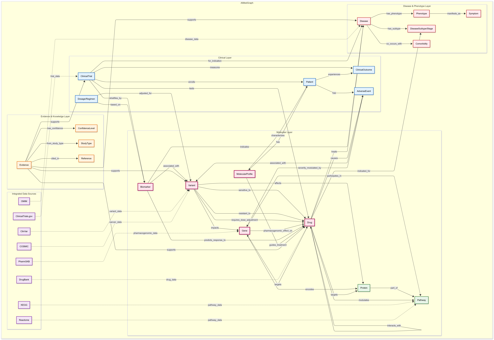

# FC — Mini-Revisão de Grafo de Conhecimento Unificado: AIMedGraph para Medicina de Precisão

**Equipe:**
|Nome  | RA | Especialização|
|--|--|--|
| Fabian Pietro de França Bram Sardagna  | 300000  | Computação |
| Carolina Albuquerque Massena Ribeiro  | 184298  | Bioinformatica |

## Resumo Executivo

**Problema.** A medicina de precisão requer conectar alterações genéticas a fenótipos e terapias, no entanto, o conhecimento está disperso em bancos de dados heterogêneos, diretrizes e literatura. O AIMedGraph aborda isso **padronizando e integrando fatos clínicos e ômicos de múltiplas fontes em um único grafo de conhecimento multi-relacional (KG)** centrado em genes, variantes, doenças, fármacos, ensaios clínicos e evidências de apoio.

**Modalidades de dados unificadas.** A versão atual integra **26.140 genes**, **187.541 variantes**, **30.340 doenças/características/fenótipos**, **2.821 fármacos**, **15.125 ensaios clínicos** e **~0,8M itens de literatura de apoio**, além de tipos de relacionamentos abrangendo **interações fármaco-fármaco (621.731)**, **susceptibilidade a fármacos (9.279)**, **efeitos farmacogenômicos (6.330)**, **patogenicidade de variantes (≈33.784)** e **reações adversas a fármacos (1.485)**. Essas entidades e arestas formam um KG de medicina de precisão que codifica relevância terapêutica, associações diagnósticas e qualificadores de evidência.

**Estratégia de unificação.** O AIMedGraph usa **normalização de ontologia/terminologia** para termos médicos (**UMLS**), subtipagem de doenças (com **OncoTree** para oncologia) e padrões **HGVS/HGNC** para nomenclatura de variantes e genes (incluindo convenções de haplótipos farmacogenéticos star-allele). Ele modela dados no **Neo4j** (grafo de propriedades) com semântica explícita de arestas (ex: *variante—pathogenic_for→doença*; *variante—affects_response_to→fármaco* com categorias: sensível, provavelmente-sensível, provavelmente-resistente, resistente). Metadados de ensaios clínicos são vinculados a fármacos/doenças/variantes; itens de literatura servem como evidência estruturada para nós/arestas.

**Tarefas de descoberta.** O grafo suporta **descoberta de relacionamentos e predição de links**. Os autores implementam pontuação **Adamic–Adar** para priorizar candidatos a arestas **fármaco–indicação**; pares fármaco–indicação conhecidos exibem pontuações AA muito maiores que predições em média (ex: gefitinib–NSCLC, imatinib–GIST, pembrolizumab–melanoma classificam alto), demonstrando sinal estrutural para **geração de hipóteses** e **reposicionamento de fármacos**.

**Principais resultados e estudos de caso.** (i) **Análises distributivas** mostram como arestas de susceptibilidade a fármacos se concentram em variantes/genes específicos (ex: *EGFR*, *KRAS*). (ii) Uma **demonstração de raciocínio** em NSCLC expande fármacos candidatos e revela ensaios clínicos vinculados via travessia do grafo. (iii) Uma consulta cruzada produz ~2.153 candidatos potenciais onde **patogenicidade de variantes** se sobrepõe à **susceptibilidade a fármacos**, apoiando hipóteses de reposicionamento (ex: **PIK3CA p.Glu453Lys** sugere *alpelisib + fulvestrant* além de carcinoma de mama).

**Limitações & trabalho futuro.** O benchmarking com verdades externas (ex: AUROC/AUPR para predição de links) **não é reportado**; algumas relações dependem de **curadoria manual** de diretrizes e literatura; **contexto (tipo de tumor, linha de terapia, dose/tempo)** pode ser parcialmente colapsado em rótulos de arestas; e práticas de **cadência de atualização/proveniência/versionamento** **não são detalhadas**. Esforços futuros devem incluir **avaliação específica para tarefas**, **granularidade de proveniência** e **modelagem de incerteza** para apoiar a tradução clínica.

## Modelo de Grafo Desenhado pela Equipe (Esquema)

*Figura 1. Esquema do KG unificado desenhado pela equipe mostrando tipos de nós/arestas, direções e semântica.*

**Legenda (nós & arestas):**

- **Nós:**  
  **Gene** (gene padronizado HGNC); **Variant** (mudança de sequência ou estrutural normalizada HGVS, incl. haplótipos star-allele); **Disease/Trait/Phenotype** (entidades clínicas padronizadas UMLS/OncoTree); **Drug** (pequenas moléculas/biólogos com indicações, interações, notas PK/PD); **Symptom/Phenotype** (descritores clínicos); **ClinicalTrial** (registro com fase/status de recrutamento); **Evidence/Reference** (artigos, diretrizes, registros de banco de dados); **AdverseEffect** (resultados de segurança de fármacos).  
- **Arestas:**  
  **pathogenic_for** (variante→doença por níveis ClinVar/ACMG); **affects_response_to** (classe de susceptibilidade variante→fármaco); **has_variant** (gene→variante); **associated_with** (gene→doença por DisGeNET); **indicated_for** (fármaco→doença); **interacts_with** (interação fármaco↔fármaco); **has_adverse_effect** (fármaco→efeito adverso); **has_symptom / has_phenotype** (doença→descritores clínicos); **studies / recruits_for / conditions_on** (links de ensaio); **supports** (nós de evidência apoiando entidades/arestas).

## Estratégia de Grafo Unificado (Do Artigo Escolhido)

**Fontes de dados:** **ClinVar** (patogenicidade variante–doença), **DisGeNET** (associações gene/variante–doença), **DrugBank** (farmacogenômica, interações), **FDA/EMEA/CSCO/NCCN/ESMO** (diretrizes de susceptibilidade a fármacos), **OncoTree** (taxonomia de oncologia), **UMLS** (termos/códigos médicos), **Entrez/Ensembl/dbSNP/1000 Genomes** (gene/variante), e **ClinicalTrials.gov** e **ChinaDrugTrial** (metadados de ensaios).

**Normalização & unificação:** **UMLS** para termos médicos; **árvores de subtipos** de oncologia guiadas por especialistas e **OncoTree**; **HGNC/HGVS** (com regra 3′) para genes/variantes; convenções **star-allele** para haplótipos farmacogenéticos; curadoria manual de especialistas para categorias de resposta a fármacos de nível de diretriz com anotações estruturadas (design do estudo, tamanho da coorte, endpoints).

**Design do esquema:** Grafo de propriedades **Neo4j**; entidades incluem fármaco, doença, gene, variante, ensaio clínico, evidência e segurança; relações incluem **classificação de doença**, **interação fármaco–fármaco**, **patogenicidade de variantes**, **susceptibilidade a fármacos** (quatro classes), **efeito farmacogenômico**, **links de ensaio–fármaco/doença/variante**, e **suporte de evidência**.

**Algoritmos para descoberta:** Predição de link **Adamic–Adar** sobre a rede heterogênea para classificar candidatos **fármaco–indicação**; pontuações AA mais altas para pares conhecidos validam sinal estrutural (exemplos: **gefitinib–NSCLC**, **imatinib–GIST**, **pembrolizumab–melanoma**). (Nenhum modelo GNN/embedding reportado.)

**Avaliação & baselines:** Os autores reportam diferenças de **pontuação AA média** entre arestas fármaco–indicação conhecidas (≈10) e preditas (~1,6) e mostram estudos de caso/visualizações de raciocínio NSCLC; **métricas de tarefa** como AUROC/AUPR, precisão@K, ou benchmarks externos **não são reportados**.

**Escalabilidade & governança:** **API/UI web pública** (Neo4j + backend Elasticsearch/MySQL; Redis; frontend Vue/NeoVis) para consulta/visualização. **Cadência de atualização, versionamento e propagação de incerteza** *não são reportados*.

## Como a Estratégia Habilita Descobertas

Como as arestas de **susceptibilidade a fármacos** e **patogenicidade** são explicitamente tipadas e apoiadas por evidência, **metacaminhos** como  
`Disease ←pathogenic_for— Variant —affects_response_to→ Drug`  
apóiam diretamente hipóteses terapêuticas e reposicionamento. Um exemplo concreto no artigo cruza **patogenicidade de variantes** com **susceptibilidade a fármacos** para revelar ~2.153 pares **fármaco–doença** candidatos. Um caso destacado: **PIK3CA p.Glu453Lys** é rotulado **sensível** a **alpelisib + fulvestrant** em carcinoma de mama; como esta variante também é **patogênica** para *megalencefalia cutis marmorata telangiectatica congenita*, o KG sugere um lead de reposicionamento plausível para explorar (sujeito a validação clínica). Para NSCLC, uma travessia centrada em doença expande opções de fármacos e resolve para **IDs de ensaios** concretos para acompanhamento.

## Limitações & Riscos

* **Benchmarking externo ausente:** Nenhuma validação AUROC/AUPR ou prospectiva para predição de links; métricas estruturais sozinhas podem superestimar confiança.  
* **Compressão de contexto:** Rótulos de arestas podem não codificar subtipo de tumor, linhas prévias de terapia, dose ou tempo—arriscando **generalização espúria**.  
* **Heterogeneidade de evidência & viés de curadoria:** Fontes mistas (diretrizes vs. literatura vs. bancos de dados) e revisão manual podem introduzir **vieses de seleção e relatório**.  
* **Lacunas de cobertura de esquema:** Ômicas além de variantes/genes (ex: proteo-/metabolômica) e evidência negativa são limitadas ou *não reportadas*.

## Discussão
O artigo “Prediction of Disease-Gene Associations by an Ensemble of Knowledge Graph Completion” publicado concomitante ao artigo de Quan X, et al. (2023) explorado anteriormente trás um complemento interessante ao mesmo. Esse estudo como objetivo aprimorar a análise genética personalizada em contextos clínicos diversos, abrangendo triagens neonatais, testes tumorais, tipagens de portadores e hibridizações in situ, por meio da integração de seis técnicas de ponta de preenchimento de grafos de conhecimento (Knowledge Graph Completion): TransE, TransD, TransR, TransH, ComplEx e DistMult. As previsões de cada técnica foram integradas em um modelo de aprendizado em conjunto (ensemble), no qual um mecanismo de votação combina os resultados individuais, reduzindo o risco de overfitting e aumentando a capacidade de generalização do modelo. Para testar o modelo, os autores utilizaram o banco de dados PrimeKG, que reúne mais de 4 milhões de associações entre 17 mil doenças e diversas entidades biológicas, com o objetivo de prever novas relações gene–doença. A eficiência do modelo foi avaliada por meio da métrica Hits@10, resultando em um valor de 0,52, o que indica uma proporção expressiva de acertos entre as dez principais associações previstas.

A aplicação do modelo proposto por Karani et al. (2024) poderia amenizar o problema da heterogeneidade das evidências e do viés de curadoria notado no trabalho de Quan X, et al. (2023). Ao estabelecer uma estrutura de inferência unificada, com critérios discricionários definidos pelo próprio modelo, capaz de integrar múltiplas fontes de informação biológica em um espaço vetorial comum de representação, a técnica promove maior consistência e reprodutividade nas inferências encontradas.

Entretanto, um dos limites compartilhados com o estudo de Quan et al. (2023) e com grande parte da literatura do campo é a ausência de informação sobre interações negativas. Historicamente, resultados experimentais negativos ou associações não confirmadas raramente são publicados, o que compromete a robustez das métricas e a validação empírica das predições. Essa lacuna impede a avaliação adequada de falsos positivos e compromete a integridade científica que depende tanto da refutação quanto da confirmação de hipóteses. 

O artigo de opinião “Why (and how) we should publish negative data”, de Simon Nimpf e David A. Keays (2019), evidencia que a negligência na divulgação de resultados negativos e predomínio de achados positivos constitui uma limitação já identificada e discutida no meio científico. Ressaltando que esse cenário distorce e exagera achados científicos, resultando na falta de reprodutibilidade de 51% a 81% dos estudos publicados, e gera desperdício de recursos ao perpetuar hipóteses incorretas e ocultar tentativas fracassadas.

No trabalho de Karani et al. (2024) em uma tentativa de contornar a ausência de exemplos negativos reais e distinguir entre dados verdadeiros e falsos, triplos negativos foram gerados sinteticamente durante o treinamento do modelo. Contudo, essa estratégia ainda não resolve o problema da falta de evidências negativas na literatura e pode acarretar na introdução de ruído e em vieses artificiais.

## Referências
1. Quan, X., Cai, W., Xi, C., Wang, C. and Yan, L. (2023). AIMedGraph: a comprehensive multi-relational knowledge graph for precision medicine. Database, 2023. doi:https://doi.org/10.1093/database/baad006.
2. Karani R, Mehta J, Mistry J, Koladia H, Bhadane C (2024) Prediction of Disease-Gene Associations by an Ensemble of Knowledge Graph Completion. Indian Journal of Science and Technology 17(11): 1078-1086. doi:https ://doi.org/10.17485/IJST/v17i11.83
3. Nimpf, S. and Keays, D.A. (2019). Why (and how) we should publish negative data. EMBO reports, 21(1). doi:https://doi.org/10.15252/embr.201949775.
